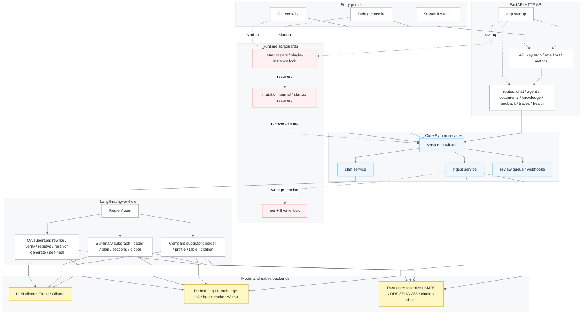
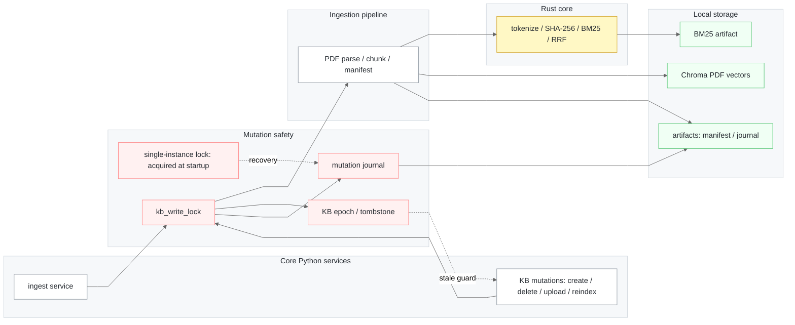
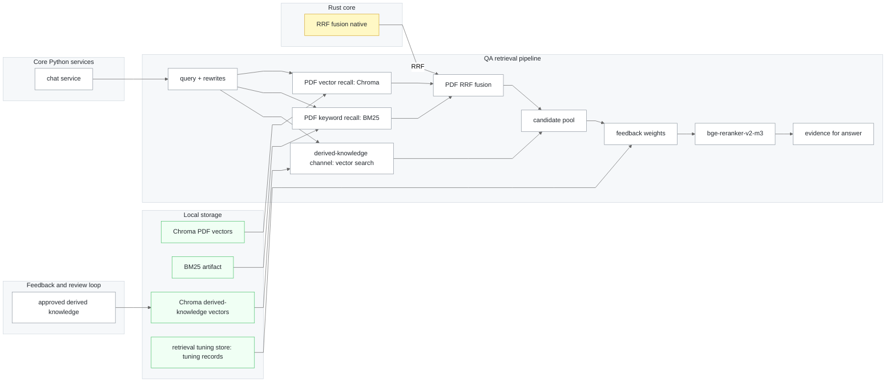
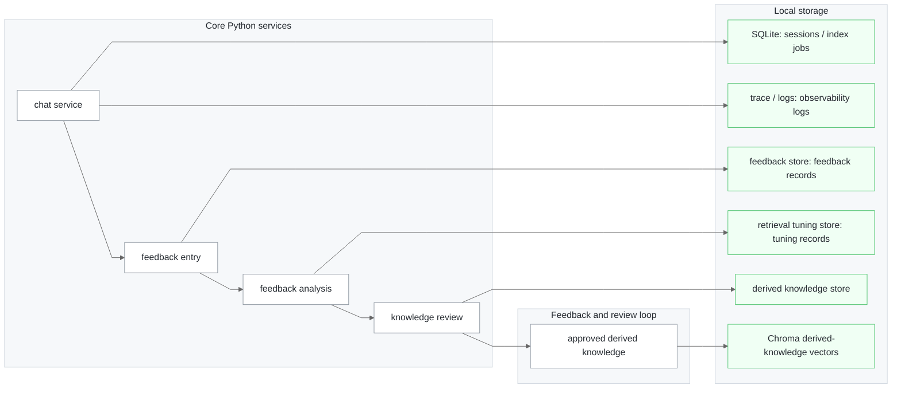

# CogDoc

> ⭐ **If CogDoc helps you, please drop a star** — it keeps the project moving and new features coming.

[English](README.md) · [简体中文](docs/README_zh-CN.md)

A local RAG knowledge-base console for individuals and teams, built on **LangGraph multi-agent orchestration** with a **deterministic Rust core (PyO3 + maturin)** underneath. It answers questions, summarizes a single document, compares multiple documents, and turns feedback into reviewable derived knowledge over your own PDF knowledge base — and every generated claim is pinned back to a `[source:Pn]` citation that is *checked, not trusted*. Use it from a **CLI console**, a **Streamlit web app** backed by FastAPI, or a standalone **Debug console** for trace inspection.

> ⚠️ **Text-layer PDFs only — no OCR yet.** Parsing extracts the text layer; pages that look scanned/image-only are flagged (`is_ocr_fallback`) and skipped, not recognized. Use PDFs that contain a real text layer.

## Feature Highlights

- **Grounded QA with verified citations** — generation is constrained to retrieved document blocks; fabricated file/page tags are caught by a Rust validator and re-generated in a self-heal loop.

- **Structured single-document summary** — fixed sections, deterministic citations bound from chunk metadata.

- **Multi-document comparison** — per-document profiles across fixed dimensions, rendered as cited dimension-by-dimension blocks.

- **Hybrid retrieval, native scoring** — Vector (Chroma + multilingual BGE-M3) and BM25 recall fused by a Rust RRF kernel, with approved derived knowledge searched as an additional evidence source; tokenization and BM25 are native — Chinese via `jieba-rs`, English lowercased + Snowball-stemmed + stopword-filtered, so both languages retrieve well.

- **Content-addressed incremental cache** — a per-file SHA-256 manifest plus a versioned chunk-identity contract: unchanged files reuse the existing index, and only a changed PDF or chunking scheme triggers an incremental rebuild.

- **Multiple knowledge bases · multiple conversations · persistent memory** — each KB runs many parallel conversations; the selected KB and session are persisted in the URL, so refresh returns to the same conversation. History is persisted to SQLite (long-term memory) and survives restart for replay. Every question carries a recent dialogue window (short-term memory, last 12 messages by default) for multi-turn coreference, and only citation-validated answers enter memory so wrong answers never poison later turns.

- **Web, CLI, and Debug entry points** — a slash-command CLI console, a Streamlit web UI over FastAPI, and a focused `make debug` console for trace inspection.

- **Derived knowledge review loop** — manually add knowledge, save validated answers, or turn corrections / no-evidence feedback into pending knowledge cards with source bindings, conflict groups, stale scans, revisions, batch approve/reject, and archive/delete flows.

- **Feedback analysis and retrieval tuning** — thumbs-up/down, corrections, ratings, issue types, and evidence context are persisted by `trace_id`; bad cases feed the offline quality ledger, feedback is analyzed into recommended actions, and retrieval-weight records can be enabled or rolled back.

- **Trace observability, review queue, and webhooks** — every request can export a safe JSON trace with config, node timings, rewrites, evidence previews, and errors; the web UI scopes traces to the current conversation, aggregates pending/stale knowledge and feedback into a review queue, and can emit webhook events for new pending knowledge.

- **API access control and rate limiting** — optional API keys protect `/v1` routes, with a token-bucket limiter that avoids throttling high-frequency health/session/trace polling.

## Feature Walkthrough

1. **Web chat with citations and evidence.** Pick a knowledge base, ask in natural language, watch the answer stream, then inspect citation sources, evidence snippets, and feedback controls.

   

2. **CLI console.** A slash-command console for knowledge bases, ingestion, multi-conversation history, and forced task modes.

   

3. **Standalone Debug console.** `make debug` opens a focused console for one KB; after a normal answer, continue with `/trace`, `/steps`, `/rewrite`, `/evidence`, and `/config`, or run `/retrieve <query>` to inspect retrieval without calling the LLM.

   

4. **Grounded QA.** Every factual sentence ends with a citation whose file name and page exist in the retrieved context; invalid ones bounce the answer back for regeneration.

   

5. **Structured summary.** Summarize one named document into fixed sections with deterministic per-section citations.

   

6. **Multi-document comparison.** Compare two or more named documents method-by-method, metric-by-metric, with citations on every cell.

   

7. **Trace debug panel.** Inspect only the current conversation's traces, including routing, query rewrites, retrieval/rerank steps, request config, and citation audits.

   

8. **Derived knowledge review center.** Add manual knowledge, save an answer, inspect source bindings, review conflicts, approve/reject/archive items, and rebuild the approved derived-knowledge index.

   

9. **Feedback and tuning.** Every thumbs-up/down, correction, and no-evidence feedback entry is tied to the answer's `trace_id`, query, answer, citations, and evidence; CogDoc turns bad cases into the evaluation ledger, converts fixable content into pending derived knowledge, and creates enable/disable retrieval-tuning records so future ranking can keep improving from human feedback.

   

## Quick Start

```bash
python -m venv .venv
source .venv/bin/activate
pip install -e ".[dev,frontend]"   # runtime + build/test + Streamlit deps
make native     # build the Rust extension: cd rust_core && maturin develop --release
make check      # verify the extension and its native symbols
make run        # build/reuse the index, warm up models, start the console
```

Dependencies live in [pyproject.toml](pyproject.toml): runtime in `[project.dependencies]`, with `dev` (build/test) and `frontend` (Streamlit client) as optional extras — install both for the full local experience via `.[dev,frontend]`. The package uses a `src/` layout (`src/cogdoc/`); the `make` targets put `src/` on `PYTHONPATH`, so no install is strictly required to run the suite.

Copy `.env.example` to `.env` and set at least your cloud `LLM_API_KEY` (or run `/local` with Ollama). Put PDFs in the inbox `your_documents/` (or set `COGDOC_DOC_DIR`). `make native` must be re-run after any change under `rust_core/src/` — the `.so` is not auto-rebuilt and not committed.

## How to Use

The CLI and web app share the same KB → ingest → ask flow. Set up once (see [Quick Start](#quick-start)): install deps, build the native extension (`make native && make check`), configure `.env`, and drop PDFs into `your_documents/`.

### CLI console

```bash
make run            # python -m cogdoc.cli
```

Then drive everything with slash commands inside the console:

1. `/kb new <name>` — create a knowledge base, `/kb` to list / switch.
2. `/add <file.pdf>` — ingest an inbox PDF from `your_documents/` into the active KB (synchronous rebuild).
3. `/new` — start a conversation; `/chats` and `/open` browse persisted history.
4. Ask directly to run **QA**; "summarize `<file>`" runs **Summary**; "compare `<a>` and `<b>`" runs **Compare**.
5. `/cloud` uses the cloud LLM, `/local` uses Ollama; `/help` lists commands; `exit` quits.
6. Use `/dk` or `/knowledge` for derived knowledge, `/feedback` for feedback records and analyses, `/tuning` for retrieval-weight controls, and `/review` for queue summaries, metrics, and export.

`make debug` opens the standalone Debug console for one KB. Ask questions there to get normal answers plus trace summaries, use `/trace`, `/steps`, `/rewrite`, `/evidence`, and `/config` to inspect the latest request, or run `/retrieve <query>` to inspect retrieval and rerank output without calling the LLM. To debug a specific KB directly, run `python -m cogdoc.debug --kb <kb_id>`.

### Web app (Streamlit + FastAPI)

```bash
make serve          # terminal 1: FastAPI at http://localhost:8000
make frontend       # terminal 2: Streamlit UI (opens in the browser)
```

In the browser:

1. **Sidebar → Knowledge base** — create a KB, or select an existing one.
2. **Sidebar → Documents** — upload a PDF and ingest it; a progress panel polls the background index job until it finishes.
3. **Conversations** — start a new conversation or reopen a previous one (session and KB persist in the URL, so a refresh resumes the same chat).
4. **Chat** — pick a mode (`auto` / `qa` / `summary` / `compare`), ask, and read the streamed answer with its citation sources, evidence snippets, and 👍/👎 feedback.
5. Toggle **Local Ollama mode** in the sidebar to route generation to the local model.
6. Open **Debug** to inspect traces for the current conversation only, or use **Retrieval debug** to call `/v1/retrieve` directly and inspect chunk hits, rerank scores, and retrieval metadata.
7. Switch the main view to **Derived Knowledge** to create knowledge, review pending/stale items, inspect feedback analysis, enable/disable retrieval tuning, export the review queue, and scan for stale bindings after document changes.

### Calling the API directly

The Streamlit app is a thin client over the FastAPI service — you can hit it directly:

| Endpoint | Purpose |
| --- | --- |
| `POST /v1/knowledge-bases`, `GET /v1/knowledge-bases` | Create / list knowledge bases |
| `POST /v1/knowledge-bases/{kb}/documents` | Upload + ingest a PDF (returns an async `job_id`) |
| `GET /v1/knowledge-bases/{kb}/sources`, `GET /v1/knowledge-bases/{kb}/sources/{source}/chunks` | Browse indexed sources and chunk previews |
| `GET /v1/index-jobs/{job_id}` | Poll ingestion progress |
| `POST /v1/chat`, `POST /v1/chat/stream` | Ask (JSON or SSE streaming) |
| `POST /v1/summary`, `POST /v1/compare` | Run explicit Summary / Compare tasks without router ambiguity |
| `POST /v1/retrieve` | Return structured retrieval hits with chunk/source/page previews |
| `GET /v1/sessions`, `GET /v1/sessions/{id}/history` | List / replay conversation history |
| `GET /v1/traces?doc_id=...&session_id=...` | List recent traces, optionally scoped to one KB/session |
| `GET /v1/traces/{trace_id}` | Fetch an exported request trace |
| `POST /v1/feedback` | Submit thumbs-up/down on a `trace_id` |
| `GET /v1/feedback`, `GET /v1/feedback-analysis` | Browse feedback records and structured feedback understanding results |
| `POST /v1/knowledge`, `GET /v1/knowledge` | Create / list derived knowledge entries |
| `POST /v1/knowledge/{id}/approve`, `/reject`, `/archive`, `/revise` | Review or revise derived knowledge |
| `POST /v1/knowledge/batch-approve`, `POST /v1/knowledge/batch-reject` | Batch review derived knowledge |
| `GET /v1/knowledge/pending-count`, `GET /v1/knowledge/index-status`, `POST /v1/knowledge/stale-scan` | Inspect pending/stale counts, derived-knowledge index state, and stale source bindings |
| `GET /v1/review-queue`, `GET /v1/review-queue/export` | Summarize and export the review queue |
| `GET /v1/feedback-loop-metrics` | Return feedback / review / tuning loop metrics |
| `GET /v1/retrieval-feedback`, `POST /v1/retrieval-feedback/{id}/enable`, `POST /v1/retrieval-feedback/{id}/disable` | Inspect or roll back feedback-derived retrieval tuning |
| `GET /healthz`, `GET /readyz`, `GET /metrics` | Health, readiness, Prometheus metrics |

If `COGDOC_API_KEYS` is configured, `/v1` requests are authenticated and rate-limited; with no keys set, `/v1` is open (the server logs a warning at startup).

## Tech Stack

- **Deterministic core** — a custom [Rust](https://www.rust-lang.org/) extension ([PyO3](https://pyo3.rs/) + [maturin](https://www.maturin.rs/)) carries `jieba-rs` CN/EN tokenization, BM25, RRF fusion, SHA-256 manifest, and citation validation — all native, independently unit-tested, stable across agent/prompt churn.
- **Retrieval** — `bge-m3` multilingual vector recall + BM25 keyword recall, fused by the Rust RRF kernel and reranked by `bge-reranker-v2-m3`; PDF vectors and approved derived-knowledge vectors live in [Chroma](https://www.trychroma.com/), PDFs are parsed by PyMuPDF.
- **Orchestration** — [LangGraph](https://langchain-ai.github.io/langgraph/) wires routing → rewrite → retrieve → generate → citation self-heal into a loopable state graph.
- **Models** — OpenAI-compatible dual backend, hot-swappable: cloud DeepSeek or local Ollama `qwen2.5:7b`.
- **Serving and observability** — FastAPI with SSE streaming, optional API-key auth and token-bucket rate limiting; sessions, index jobs, feedback, review queues, and derived knowledge are persisted locally; JSON traces exported for the web Trace panel and standalone Debug console.

## Architecture

>  **Solid lines** → runtime call / data flow &nbsp;|&nbsp; **Dashed lines** → startup / safeguard relations

**Runtime Path**



CLI and Debug bypass the FastAPI HTTP adapter; they call the same Python services in-process. The Streamlit UI is the built-in entry point that talks to FastAPI over HTTP/SSE. CLI, Debug, and FastAPI all acquire the single-instance process lock at startup, then recover the mutation journal before serving KB mutations.

The next diagram expands ingestion, retrieval, and local persistence boundaries: source PDFs and approved derived knowledge are indexed separately, then joined into one candidate pool at query time; feedback does not rewrite indexes directly, but is persisted as reviewable records or rollbackable retrieval tuning.

**Index, Retrieval, and Storage**

**Indexing and mutation path**



**QA retrieval path**



**Feedback, review, and persistence path**



Summary builds a fixed-section structured summary of one named document; Compare builds a per-document profile across fixed dimensions and renders cited Markdown comparison blocks grouped by dimension. Both bind `[source:Pn]` citations deterministically from chunk metadata and run the same `validate_citations_native` checker as QA.

The Python layer owns orchestration, prompts, model clients, indexing, the CLI console, the standalone Debug console, and the FastAPI/Streamlit front ends. Approved derived knowledge is stored/reviewed in Python, indexed into Chroma, and searched as a separate QA evidence source; pending, stale, rejected, and archived entries do not enter retrieval. The Rust layer (`rust_core`) owns deterministic kernels that stay stable across agent changes and are unit-tested independently.

## Indexing Pipeline

Driven by `build_kb_index_transactional` whenever a KB's files change (`/add`, `/rm`, or the cloud upload/delete endpoints):

1. **Scan** — `scan_pdf_manifest_native` (Rust) hashes every PDF with rayon-parallel, 1 MiB-buffered SHA-256 and returns `{doc_id, documents: [{name, size, sha256}]}`, sorted by filename.
2. **Compare** — `manifests_match` reuses the index only if `doc_id`, `chunk_identity_version`, and every `{name, sha256}` match the saved manifest; any mismatch forces a rebuild.
3. **Parse** — `smart_parse` (PyMuPDF) extracts page text, reflows two-column layouts by block center-x, and flags likely scanned pages (`is_ocr_fallback`). No OCR is performed; flagged pages contribute no text.
4. **Chunk** — `chunk_paper` keeps each chunk under 600 chars with 60-char overlap (30-char min), preferring paragraph, sentence/semicolon, newline, and whitespace boundaries before falling back to a fixed window for very long unbroken text. Each chunk stores up to 160 chars of surrounding context, maps back to its page span via `bisect`, and receives a stable `chunk_id`.
5. **Index** — chunks land in Chroma (vector) and a persisted BM25 artifact that stores a compact chunk registry plus native `Bm25Index` bytes. Loading restores the native index from bytes instead of rebuilding it from a Python tokenized corpus. `save_index_manifest` persists the manifest. Tokenization uses `tokenize_mixed_text_native` / `tokenize_corpus_native` (`jieba-rs` for Chinese, Snowball stemming + stopword removal for English).

Approved derived knowledge is indexed separately from source PDFs. Review actions can rebuild its Chroma collection, and stale scans mark knowledge whose document binding no longer matches the current KB documents.

**Chunk identity contract:**

```
chunk_id = sha256:{source_sha256}:src:{source_name}:p{page_start}-p{page_end}:c{local_chunk_index}
```

`chunk_id` is the single stable identity key across chunker, index, retriever, RRF, and evidence — dedup and fusion never rely on array position. It is versioned (`chunk_identity_version = source_sha256_name_page_span_local_v3_semantic_cs600_ov60_min30_ctx160`); changing chunk boundaries must bump `CHUNK_IDENTITY_BASE_VERSION` so stale indexes rebuild instead of mixing schemes.

## Query Pipeline

- **Intent routing** — `RouterAgent` asks the LLM for structured `task_type ∈ {qa, summary, compare, unknown}` and falls back to a keyword rule on any parse error. All of `qa`, `summary`, and `compare` are wired to real subgraphs.
- **Rewrite + drift guard** — `QueryRewriteAgent` emits 1–3 keyword queries (pydantic structured output). `RewriteVerifyAgent` embeds `[original] + rewrites` in one batch, keeps those with `cosine >= rewrite_similarity_threshold` (default `0.5`), logs kept/dropped to `steps_trace`, and falls back to the original query alone if all are dropped.
- **Hybrid retrieval + RRF** — per query, both PDF channels over-recall `top_k * 3` (QA uses `top_k = 9` → 27/channel); `rrf_fusion_native` (Rust, `k = 60`) computes `score(d) = Σ_c 1 / (k + rank_c(d))`, merges hits sharing a `chunk_id`, and sorts by score desc then identity key asc for determinism. Approved derived knowledge is searched per original/rewrite query and merged into the same evidence pool, then feedback-derived retrieval weights are applied before rerank.
- **Rerank** — `BGEReranker` (`bge-reranker-v2-m3`) scores `(original_query, doc)` and keeps `top_n = 3`; rewrites never bias the final ranking.
- **Generation + citation self-heal** — `Generator` (OpenAI-compatible; cloud `deepseek-chat` or local `qwen2.5:7b`, `temperature = 0.2`) wraps docs as `<Document source=… page=… chunk_id=…>` and forces `[source:Pn]` tags. `validate_citations_native` (Rust) returns structured `missing_citations` / `invalid_sources` / `invalid_pages`; `citation_node` turns failures into a critique and loops `generate → citation` up to `max_iteration_count` (default `2`). Only validated answers are printed.

**Summary subgraph** — `document_loader` selects one named document (or the only document in the corpus; ambiguous multi-document queries get an actionable message), `section_planner` fixes the sections to background/goals, solution/process, rules/requirements, value/output, and limitations/notes unless custom titles are supplied in state, `section_summary` writes one short paragraph per section (model writes prose only; `[source:Pn]` tags are bound deterministically from the chunks it used), and `global_summary` assembles the answer and re-runs the citation checker. No-evidence sections carry no citation and no evidence.

**Compare subgraph** — `document_loader` requires at least two explicitly named documents; local Ollama mode caps this at two documents. `document_profile` builds a per-document profile across fixed dimensions (cloud: method / data / metrics / strengths / limitations / scenarios; local: method / data / metrics / limitations) reusing the Summary cell primitive. `compare_table` renders Markdown comparison blocks; cloud mode also asks for a short guarded conclusion, while local mode skips that extra call to reduce memory pressure. `compare_citation_node` validates the conclusion independently and then the comparison blocks; any failure downgrades to the bare blocks with a warning. An all-no-evidence comparison is not flagged as missing citations.

## Native Core

`rust_core` is a PyO3/maturin extension, loaded via `tools.rust_core_loader.ensure_rust_core`, which fails fast with a `maturin develop` hint if the build is missing or a symbol is stale. It exposes six native symbols, all listed in `scripts/check_native.py` so `make check` fails against a stale build.

| Symbol | Module | Purpose |
| --- | --- | --- |
| `scan_pdf_manifest_native` | `scanner.rs` | Rayon-parallel, buffered SHA-256 of every PDF; size + hash manifest, stably sorted |
| `rrf_fusion_native` | `rrf.rs` | Deterministic RRF (`k=60`) merge of vector + BM25 results, keyed on `chunk_id` |
| `validate_citations_native` | `citation.rs` | Structured citation check → `invalid_sources` / `invalid_pages` / `missing_citations` |
| `tokenize_mixed_text_native` | `tokenizer.rs` | Mixed CN/EN tokenizer: `jieba-rs` for Chinese, Snowball stemming + stopword removal for English (identifiers/versions kept verbatim); token-for-token aligned with a Python reference |
| `tokenize_corpus_native` | `tokenizer.rs` | Batch corpus tokenizer used by BM25 indexing to avoid Python-side per-document tokenization loops |
| `Bm25Index` (class) | `bm25.rs` | BM25 index + `score_topk` + native bytes persistence, bit-aligned with `rank_bm25.BM25Okapi`; top-k selected natively |

## Project Layout

```text
CogDoc/
├── src/cogdoc/
│   ├── cli.py
│   ├── debug.py
│   ├── agents/
│   ├── api/
│   │   └── routes/
│   ├── config/
│   ├── frontend/
│   ├── graph/
│   │   └── subgraphs/
│   ├── observability/
│   ├── service/
│   └── tools/
│       └── retriever/
├── rust_core/src/
├── scripts/
├── tests/
├── eval/
├── docs/
└── pyproject.toml
```

| Path | Responsibility |
| --- | --- |
| `src/cogdoc/cli.py` | Multi-KB, multi-conversation CLI entry point (`python -m cogdoc.cli` / `cogdoc`) |
| `src/cogdoc/debug.py` | Standalone Trace Debug console (`python -m cogdoc.debug` / `cogdoc-debug`) |
| `src/cogdoc/agents/` | Routing, query rewrite, generation, citation validation, feedback understanding, and Summary / Compare agent primitives |
| `src/cogdoc/api/` | FastAPI app, routes, schemas, persistence, access control, metrics, feedback / knowledge stores, webhooks |
| `src/cogdoc/frontend/` | Streamlit thin client and API client |
| `src/cogdoc/graph/` | LangGraph state, main workflow, and QA / Summary / Compare subgraphs |
| `src/cogdoc/service/` | Chat / ingest services, KB lifecycle, transactional indexing, locks, cleanup, and background work |
| `src/cogdoc/tools/` | PDF parsing, chunking, manifests, embedding, rerank, Rust loading, and retrievers |
| `rust_core/src/` | PyO3 native core: scanner, tokenizer, BM25, RRF, citation validator |
| `scripts/`, `tests/`, `eval/`, `docs/` | Health-check scripts, tests, offline eval sets, and project docs |

## Configuration

| Variable | Default | Purpose |
| --- | --- | --- |
| `COGDOC_DOC_DIR` | `your_documents` | Inbox directory of PDFs that `/add` ingests into a KB |
| `COGDOC_DATA_DIR` | `./data` | Root for persisted KB state, SQLite DBs, manifests, and index artifacts |
| `COGDOC_TRACE_ENABLED` | `true` | Enable JSON trace export for request inspection |
| `COGDOC_TRACE_DIR` | `logs/traces` | Directory for exported trace JSON files |
| `COGDOC_WEBHOOK_URL` | unset | Optional endpoint for pending knowledge review events |
| `COGDOC_WEBHOOK_SECRET` | unset | Optional shared secret sent with webhook requests |
| `COGDOC_WEBHOOK_TIMEOUT_SECONDS` | `3` | Timeout for webhook delivery attempts |
| `COGDOC_FEEDBACK_STORE` | `jsonl` | Feedback storage backend; set `sqlite` to use SQLite with JSONL export |
| `COGDOC_DERIVED_KNOWLEDGE_INDEX_AUTO_REFRESH` | `false` | Rebuild approved derived-knowledge vectors in the background after review changes |
| `COGDOC_API_KEYS` | unset | Comma-separated API keys; empty disables API auth |
| `RATE_LIMIT_PER_MINUTE` | `120` | Token-bucket refill rate for protected API routes |
| `RATE_LIMIT_BURST` | `120` | Token-bucket burst capacity; `<=0` disables rate limiting |
| `COGDOC_MAX_UPLOAD_MB` | `50` | Maximum PDF upload size through the API/frontend |
| `QA_ABSTAIN_ENABLED` | `true` | Return a deterministic no-evidence answer before LLM generation when retrieval confidence is low |
| `QA_ABSTAIN_MAX_VECTOR_DISTANCE` | `0.86` | Maximum accepted normalized-vector L2 distance |
| `QA_ABSTAIN_MIN_BM25_SCORE` | `10.0` | BM25 score that can independently establish retrieval support |
| `QA_ABSTAIN_MIN_KNOWLEDGE_SCORE` | `0.5` | Minimum support score for approved derived knowledge |
| `QA_EVIDENCE_VERIFY_ENABLED` | `true` | Verify exact-fact questions against retrieved chunks before answer generation |
| `QA_EVIDENCE_VERIFY_MAX_DOCS` | `3` | Maximum source-diversified chunks sent to the evidence verifier |
| `QA_EVIDENCE_VERIFY_MAX_CHARS_PER_DOC` | `1600` | Per-chunk text limit for evidence verification |
| `QA_EVIDENCE_VERIFY_BORDERLINE_MIN_SCORE` | `0.75` | Minimum first-stage support score eligible for verifier rescue |
| `OLLAMA_BASE_URL` | `http://localhost:11434/v1` | Local OpenAI-compatible Ollama endpoint |
| `OLLAMA_MODEL_NAME` | `qwen2.5:7b` | Local model name |
| `OLLAMA_TIMEOUT_SECONDS` | `180` | Local model request timeout |
| `LLM_BASE_URL` | `https://api.deepseek.com/v1` | Cloud OpenAI-compatible endpoint |
| `LLM_MODEL_NAME` | `deepseek-chat` | Cloud model name |
| `LLM_API_KEY` | `your-cloud-api-key-here` | Cloud API key |
| `LLM_TIMEOUT_SECONDS` | `90` | Cloud model request timeout |
| `LLM_<NODE>_BACKEND` | `default` | Per-node backend: `default`, `cloud`, or `local` |
| `LLM_<NODE>_MODEL_NAME` | unset | Per-node cloud model override |
| `OLLAMA_<NODE>_MODEL_NAME` | unset | Per-node local model override |
| `HF_TOKEN` | unset | Optional Hugging Face Hub token |

`<NODE>` can be `ROUTER`, `QUERY_REWRITER`, `SOURCE_RESOLVER`, `EVIDENCE_VERIFIER`, `QA_GENERATOR`, `SUMMARY_GENERATOR`, `COMPARE_PROFILE`, or `COMPARE_CONCLUSION`. For independent review, for example, set `LLM_EVIDENCE_VERIFIER_BACKEND=local` and `OLLAMA_EVIDENCE_VERIFIER_MODEL_NAME=<review-model>` while keeping answer generation on the cloud backend. Citation syntax and source/page membership remain deterministically validated by Rust rather than by an LLM.

Requirements: Python 3.11+ (developed on 3.13; the extension targets 3.8+), a Rust toolchain with `cargo` (edition 2024, via [rustup](https://rustup.rs/)), and [maturin](https://www.maturin.rs/). Optional: [Ollama](https://ollama.com/) for local models. See `.env.example` for the full set of tunables (retrieval `top_k`, rerank `top_n`, RRF `k`, CUDA memory floors, eval set paths).

## Development & Testing

| Command | Description |
| --- | --- |
| `make native` | Build / rebuild `rust_core` (required after editing `.rs`) |
| `make check` | Verify the extension is importable and all native symbols exist |
| `make test` | Run the Python test suite |
| `make smoke-api` | Run an in-process API smoke test without real LLM/index work |
| `make backup` | Back up local runtime state under `backups/` |
| `make eval` | Run offline retrieval evaluation (`recall@k`, MRR) |
| `make eval-coverage` | Check retrieval eval coverage without running real retrieval |
| `make eval-retrieval-report` | Run the 100-query retrieval profile and write its report |
| `make eval-retrieval-baseline` | Generate the reviewed real-retrieval baseline |
| `make eval-retrieval-gate` | Enforce absolute thresholds and compare with the retrieval baseline |
| `make eval-quality` | Run offline quality evaluation (router, citations, faithfulness ledger) |
| `make eval-quality-coverage` | Run quality metrics and enforce coverage dimensions |
| `make eval-suite` | Run the combined eval gate (coverage audits + quality metrics) |
| `make eval-suite-run-retrieval` | Run the combined eval suite and execute real retrieval metrics |
| `make eval-suite-report` | Write `eval/eval_suite_report.json` |
| `make eval-suite-baseline` | Compare against `eval/eval_suite_baseline.json` |
| `make eval-suite-update-baseline` | Refresh `eval/eval_suite_baseline.json` after review |
| `make run` | Start the interactive CLI console |
| `make serve` | Start the FastAPI service (`uvicorn cogdoc.api.app:app`) |
| `make frontend` | Start the Streamlit web app |
| `make debug` | Start the standalone Debug console |
| `cd rust_core && cargo test` | Run Rust unit tests |
| `cd rust_core && cargo fmt --check` | Check Rust formatting |

Test layering: business logic and the Python↔native API contract are tested in Python (`tests/`); pure-Rust logic uses Rust `#[test]` in `rust_core/src/`. Native-dependent Python tests `importorskip` when `rust_core` is not built, so run `make native` before a full regression.

Offline evaluation uses local JSONL files under `eval/`. `make eval-suite` is the default lightweight gate: it audits retrieval and quality eval coverage, runs quality metrics, prints summaries by case type and layer, and skips model-backed retrieval by default. `make eval-suite-report` writes `eval/eval_suite_report.json`; `make eval-suite-baseline` compares aggregate, case-type, and layer-level quality metrics against `eval/eval_suite_baseline.json`; `make eval-suite-update-baseline` refreshes that baseline after review. Generated reports and baselines are ignored by Git.

The real-retrieval profile expects at least 100 reviewed queries in `eval/retrieval_eval.jsonl`: 40 single-source, 20 multi-source, 20 hard, and 20 no-answer. `make eval-retrieval-baseline` records the reviewed reference run, while `make eval-retrieval-gate` compares relevance metrics with that baseline and enforces the absolute limits in the local `eval/retrieval_gate.json`; use `eval/retrieval_gate.example.json` as its schema. Reports include aggregate and per-layer MRR/Recall/Hit metrics, mean and P95 latency, and a separately reported warmup that is excluded from steady-state latency. `answerable_acceptance_rate` and `no_answer_abstention_rate` measure the deterministic first-stage evidence gate directly. Exact-fact questions that pass that gate, plus borderline candidates above `QA_EVIDENCE_VERIFY_BORDERLINE_MIN_SCORE`, receive a second structured evidence-sufficiency check before generation. No-answer rows also report `no_answer_false_positive@k`; that metric only says whether the retriever returned candidates, not whether either gate accepted them or the generated answer was false. The default distance/BM25 thresholds were calibrated on the local reviewed set and should be recalibrated when the corpus or embedding model changes.

`make eval` runs an ad hoc retrieval check against the local set and falls back to `eval/retrieval_eval.example.jsonl` on a clean checkout. `make eval-coverage` checks the smoke profile without touching the index. Run `make eval-suite-run-retrieval` when the combined suite should also execute real retrieval. `make eval-quality` measures router accuracy, citation accuracy, and the manual faithfulness ledger across QA, Summary, Compare, multi-turn, no-answer, and feedback layers; `make eval-quality-coverage` additionally enforces the required case types and recommended layers. Thumbs-down and correction feedback writes `eval_draft` rows to `bad_cases.jsonl`, so reviewed cases can be promoted into the quality eval set. For a coverage-only quality check, run `python scripts/eval_quality.py --coverage-only`. `--coverage-only` is intentionally incompatible with `--check-coverage`, `--json`, and `--baseline`.

Run `python scripts/eval_retrieval.py --rerank --verify-evidence` to include the cloud evidence verifier in final acceptance/abstention metrics; add `--local-verifier` to use Ollama. This mode makes model calls and is intentionally excluded from the default retrieval gate.

Every chat request gets a `request_id`/`trace_id`. When `COGDOC_TRACE_ENABLED=true`, the service writes JSON traces under `COGDOC_TRACE_DIR` (default `logs/traces`), and the same safe payload is available through `GET /v1/traces/{trace_id}`. `GET /v1/traces` lists recent traces and can be scoped by `doc_id` and `session_id`, which is how the Streamlit Trace panel shows only the current conversation. Trace files include `schema_version`, `status` (`ok`, `degraded`, or `failed`), total `duration_ms`, a safe config snapshot, step summaries, rewrite summaries, error summaries, and only truncated evidence previews rather than full document text. The standalone Debug console reads the same trace format.

Backup/restore and index rebuild rules are covered in [PRODUCTION_zh-CN.md](docs/PRODUCTION_zh-CN.md).

## Known Limitations

- **No OCR.** Scanned or image-only PDFs are not supported — `smart_parse` only reads the text layer and flags such pages as `is_ocr_fallback` without extracting their text. Use PDFs with a real text layer.
- Summary and Compare are fixed-schema MVPs; cloud mode runs independent section/dimension LLM cells concurrently with stable output order, while local Ollama mode stays serial to avoid memory pressure. The default section/dimension sets are fixed unless passed through graph state.
- Local Compare intentionally supports only two documents, uses four core dimensions, and skips the extra conclusion generation step to reduce Ollama memory pressure.
- Citation validation checks physical citation legality (`source` and `page`), not whether the surrounding sentence is semantically perfect, nor whether every sentence is cited.
- The rewrite similarity threshold defaults to `0.5` and should be calibrated on real project data.
- Local model downloads may require network access or a pre-populated Hugging Face cache.

## Troubleshooting

- `Rust 扩展 rust_core 未安装` / `缺少: …` — run `make native`, then `make check`.
- Rust edits don't change behavior — you didn't rebuild; the old `.so` is still loaded. Run `make native`.
- `Model Mismatch!` — the index's embedding model differs from `Embedder.MODEL_NAME`; rebuild the index (clear the `doc_id`'s Chroma collection or change `doc_id`).
- Streamlit can't reach the backend — start `make serve` first, and check the **Backend URL** field in the sidebar (defaults to `http://localhost:8000`).
- Hugging Face anonymous-rate warning — set `HF_TOKEN` for higher Hub limits; public models usually download without it.

## License

[MIT](./LICENSE)
