# CogDoc

> ⭐ **如果 CogDoc 对你有帮助，欢迎点个 Star** — 这是项目持续迭代和加新功能的动力。

[English](../README.md) · [简体中文](README_zh-CN.md)

一个面向个人 / 企业的本地 RAG 知识库控制台，上层是 **LangGraph 多 Agent 编排**，底层是**确定性 Rust 核心（PyO3 + maturin）**。它能在你自己的 PDF 知识库上做问答、总结单篇文档、对比多篇文档，也能把反馈沉淀为可审核的派生知识——而且每条生成结论都会绑定回 `[source:Pn]` 引用，并且这个引用是**经过校验的，而非默认可信**。你可以用**命令行控制台**、基于 FastAPI 服务的 **Streamlit 网页端**，也可以用独立 **Debug 控制台**查看 trace。

> **可选本地 OCR。** OCR 默认关闭；开启后，原生文本不足的页面会由 PyMuPDF 渲染，并交给本机 Tesseract CLI 识别，带文字层的页面仍走现有快速路径。

## 功能特点

- **带可验证引用的问答** — 生成被约束在召回的文档块内；捏造的文件/页码标签会被 Rust 校验器抓出，并在自愈循环里重新生成。

- **单文档结构化摘要** — 固定章节，引用从 chunk 元数据确定性绑定。

- **多文档对比** — 在固定维度上逐文档建 profile，按维度渲染带引用的对比块。

- **混合检索、native 打分** — 向量（Chroma + 多语言 BGE-M3）与 BM25 两路召回由 Rust RRF kernel 融合，已审核派生知识会作为额外证据源一起检索；分词与 BM25 均为 native——中文走 `jieba-rs`，英文做小写化 + Snowball 词干化 + 停用词过滤，中英文都召得回。

- **内容寻址的增量缓存** — 逐文件 SHA-256 manifest 加带版本的 chunk 身份契约：未变化的文件直接复用已建索引，只有 PDF 内容或切块方案真正变化时才增量重建。

- **多知识库 · 多对话 · 分层记忆** — 完整展示历史持久化用于回放；通过引用校验的近期回合组成有界短期记忆，被淘汰回合转为会话级摘要和决策，只有带明确记忆信号的稳定事实才进入跨会话长期记忆，错误答案不会进入 Agent 记忆。

- **网页端、CLI 与 Debug 入口** — 斜杠命令 CLI、基于 FastAPI 的 Streamlit 网页端，以及聚焦 trace 诊断的 `make debug` 控制台。

- **派生知识审核闭环** — 支持手动新增知识、保存已校验答案、把纠错/无依据反馈转成待审核知识卡片；每条知识可绑定来源、检测冲突、扫描过期、创建修订版本，并支持批量通过/驳回、归档和删除。

- **反馈分析与检索调权** — 赞踩、纠错、评分、问题类型和 evidence 上下文按 `trace_id` 落盘；坏样本进入离线质量台账，反馈会被结构化分析为建议动作，检索调权记录可启用或回滚。

- **Trace 可观测、审核队列与 webhook** — 每次请求可导出安全 JSON trace，包含请求配置、节点耗时、改写、证据预览与错误摘要；网页端只展示当前对话的 trace，并把待审核/过期知识、反馈分析、检索调权聚合成审核队列，也可在新待审核知识产生时投递 webhook。

- **API 鉴权与限流** — 可选 API key 保护 `/v1` 路由，并使用令牌桶限流；健康检查、会话列表和 trace 轮询等高频只读接口不会误伤正常使用。

## 功能演示

1. **网页端对话、引用与证据。** 选一个知识库，自然语言提问，看着答案流式生成，再展开引用来源和证据片段，并打 👍/👎 反馈。

   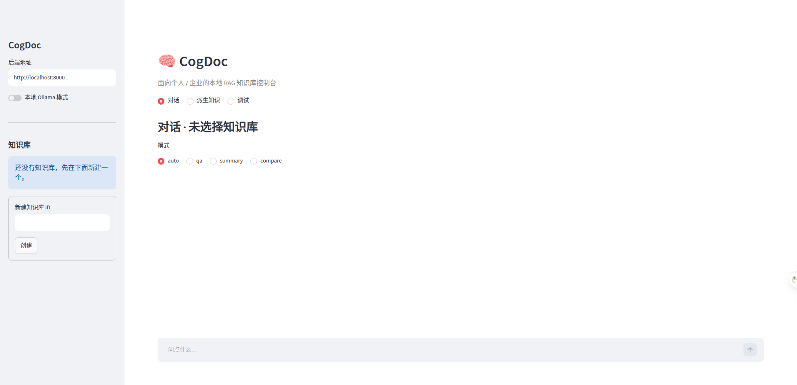

2. **命令行控制台。** 用斜杠命令管理知识库、入库、多对话历史和强制任务模式。

   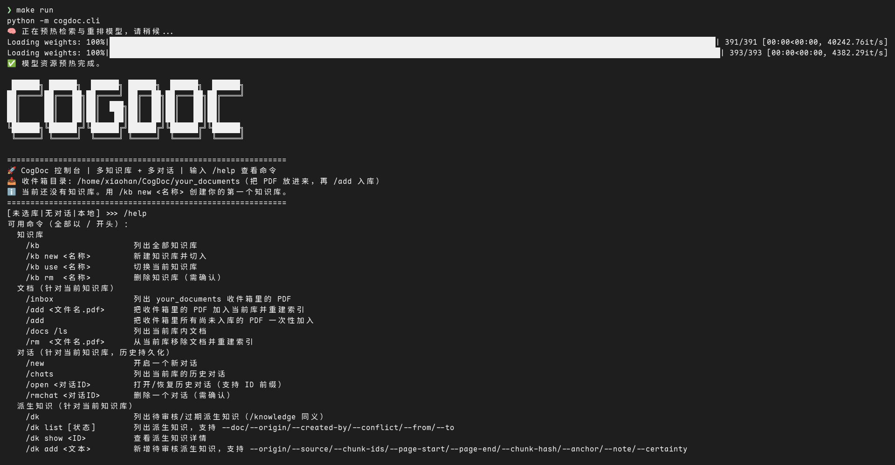

3. **独立 Debug 控制台。** `make debug` 针对一个知识库调试，普通提问后可继续用 `/trace`、`/steps`、`/rewrite`、`/evidence`、`/config` 查看细节，也可以用 `/retrieve <问题>` 只看召回与重排结果。

   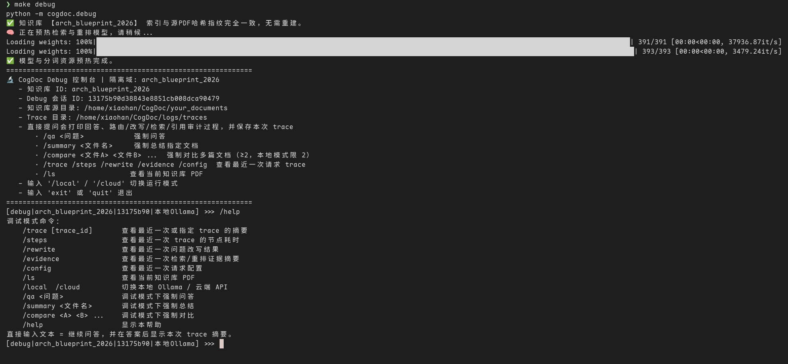

4. **带引用的问答。** 每条事实性句子都以引用结尾，且引用的文件名和页码必须存在于本轮检索上下文中；非法引用会把回答打回重新生成。

   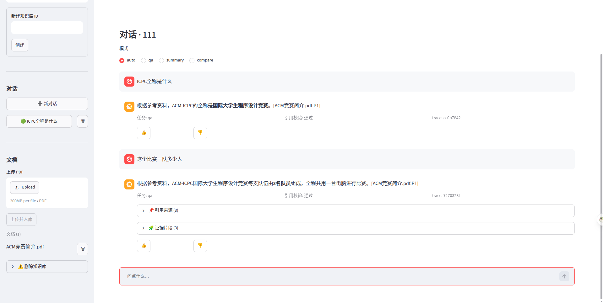

5. **结构化摘要。** 把一篇点名文档总结为固定章节，每节带确定性引用。

   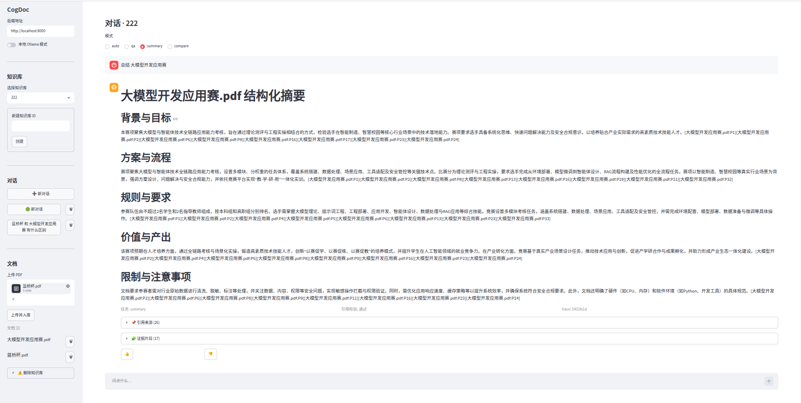

6. **多文档对比。** 对两篇或更多点名文档逐方法、逐指标对比，每个单元格都带引用。

   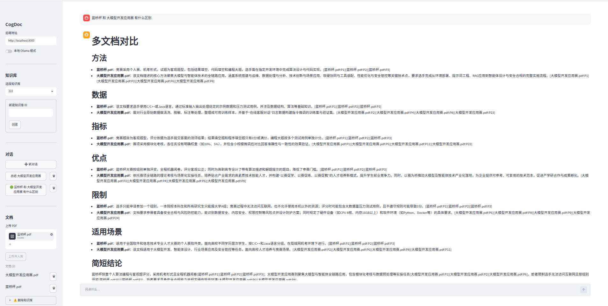

7. **Trace 调试面板。** 只查看当前对话的 trace，可视化路由判别、问题改写、召回与重排、请求配置和引证审计。

   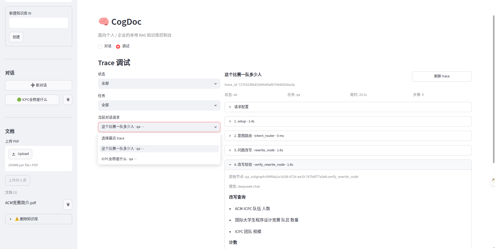

8. **派生知识审核中心。** 新增知识、保存答案、检查来源绑定、查看冲突、通过/驳回/归档待处理项，并重建已通过派生知识索引。

   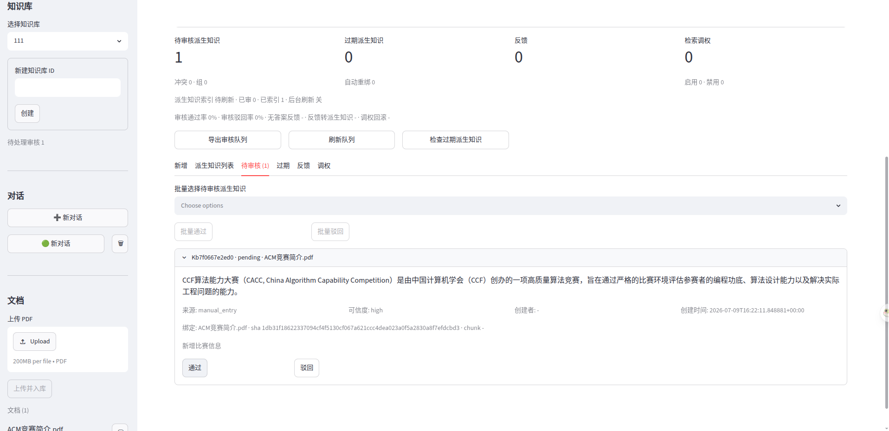

9. **反馈与调权。** 每次赞踩、纠错和无依据反馈都会关联到本次回答的 `trace_id`、问题、答案、引用与证据；系统会把坏样本沉淀到评测台账，把可修正内容转为待审核派生知识，并生成可启用/禁用的检索调权记录，让后续召回排序能被人工反馈持续校正。

   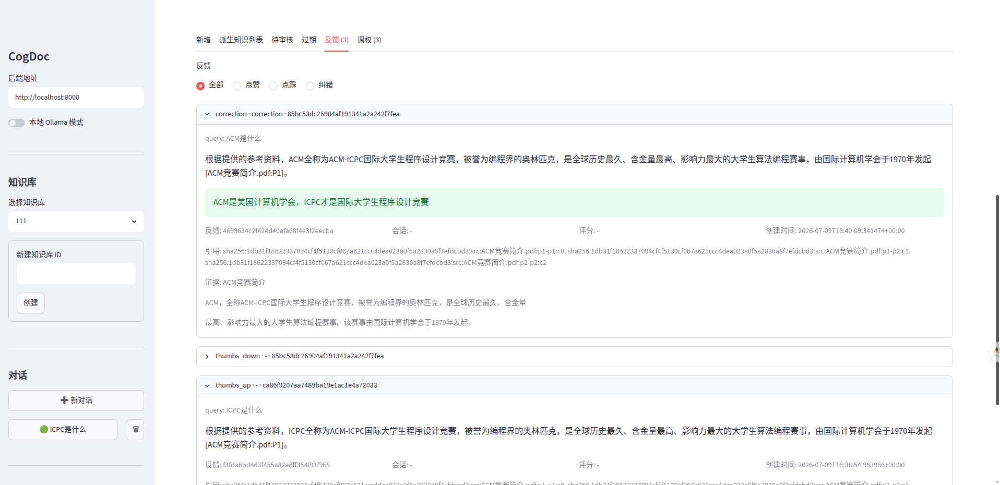

## 快速开始

```bash
python -m venv .venv
source .venv/bin/activate
pip install -e ".[dev,frontend]"   # 运行时 + 构建/测试 + Streamlit 依赖
make native     # 构建 Rust 扩展：cd rust_core && maturin develop --release
make check      # 校验扩展及其 native 符号
make run        # 构建/复用索引、预热模型、启动控制台
```

依赖统一在 [pyproject.toml](../pyproject.toml)：运行时依赖在 `[project.dependencies]`，`dev`（构建/测试）与 `frontend`（Streamlit 客户端）为可选 extras；完整本地体验建议安装 `.[dev,frontend]`。包采用 `src/` 布局（`src/cogdoc/`）；`make` 目标会把 `src/` 加入 `PYTHONPATH`，因此跑测试无需先安装。

把 `.env.example` 复制为 `.env`，至少设置云端 `LLM_API_KEY`（或用 `/local` 走 Ollama）。把 PDF 放进收件箱 `your_documents/`（或设置 `COGDOC_DOC_DIR`）。每次修改 `rust_core/src/` 下的代码后都必须重跑 `make native`——`.so` 不会自动重建，也不纳入版本控制。

## 使用流程

CLI 和网页端共用同一条 建库 → 入库 → 提问 流程。先按[快速开始](#快速开始)装一次环境：安装依赖、构建原生扩展（`make native && make check`）、配置 `.env`、把 PDF 放进 `your_documents/`。

### 命令行控制台

```bash
make run            # python -m cogdoc.cli
```

之后在控制台里用斜杠命令完成全部操作：

1. `/kb new <名称>` — 建知识库，`/kb` 列出/切换。
2. `/add <文件.pdf>` — 把收件箱 `your_documents/` 里的 PDF 加入当前库（同步重建索引）。
3. `/new` — 开新对话；`/chats`、`/open` 浏览持久化历史。
4. 直接提问走 **QA**；"总结 `<文件>`" 走 **Summary**；"对比 `<a>` 和 `<b>`" 走 **Compare**。
5. `/cloud` 用云端 LLM，`/local` 用 Ollama；`/help` 列出命令；`exit` 退出。
6. `/dk` 或 `/knowledge` 管理派生知识，`/feedback` 查看反馈与反馈分析，`/tuning` 控制检索调权，`/review` 查看审核队列摘要、闭环指标和导出结果。

`make debug` 打开针对单个库的独立 Debug 控制台。可以直接提问获得回答和 trace 摘要，再用 `/trace`、`/steps`、`/rewrite`、`/evidence`、`/config` 查看最近一次请求，也可以用 `/retrieve <问题>` 只检查召回和重排输出、不调用 LLM。需要直接调试指定知识库时，可运行 `python -m cogdoc.debug --kb <kb_id>`。

### 网页端（Streamlit + FastAPI）

```bash
make serve          # 终端 1：FastAPI，地址 http://localhost:8000
make frontend       # 终端 2：Streamlit 网页端（自动在浏览器打开）
```

在浏览器里：

1. **侧栏 → 知识库** — 新建一个库，或选择已有的库。
2. **侧栏 → 文档** — 上传 PDF 并入库；进度面板会轮询后台入库任务直到完成。
3. **对话** — 新建对话或重开历史对话（会话和知识库持久化进 URL，刷新后续上同一对话）。
4. **聊天** — 选模式（`auto` / `qa` / `summary` / `compare`），提问，读流式答案及其引用来源、证据片段和 👍/👎 反馈。
5. 在侧栏打开 **本地 Ollama 模式** 即可把生成切到本地模型。
6. 打开 **调试**，只查看当前对话的请求 trace；也可以用 **检索调试** 直接调用 `/v1/retrieve`，检查命中 chunk、重排分数和 retrieval 元数据。
7. 切到主视图里的 **派生知识**，可以新增知识、审核待处理/过期项、查看反馈分析、启用/禁用检索调权、导出审核队列，并在文档变化后扫描过期绑定。

### 直接调用 API

Streamlit 前端只是 FastAPI 服务上的瘦客户端——你也可以直接调用：

| 端点 | 用途 |
| --- | --- |
| `POST /v1/knowledge-bases`、`GET /v1/knowledge-bases` | 创建 / 列出知识库 |
| `POST /v1/knowledge-bases/{kb}/documents` | 上传 + 入库 PDF（返回异步 `job_id`） |
| `GET /v1/knowledge-bases/{kb}/sources`、`GET /v1/knowledge-bases/{kb}/sources/{source}/chunks` | 浏览已索引来源文件与 chunk 预览 |
| `GET /v1/index-jobs/{job_id}` | 轮询入库进度 |
| `POST /v1/chat`、`POST /v1/chat/stream` | 提问（JSON 或 SSE 流式） |
| `POST /v1/summary`、`POST /v1/compare` | 显式执行 Summary / Compare，避免路由歧义 |
| `POST /v1/retrieve` | 返回结构化检索命中，包含 chunk/source/page 预览 |
| `GET /v1/sessions`、`GET /v1/sessions/{id}/history` | 列出 / 回放对话历史 |
| `GET /v1/sessions/{id}/memory` | 查看短期、中期和长期记忆快照 |
| `DELETE /v1/memory/long-term?doc_id=...` | 清除一个知识库的长期记忆 |
| `GET /v1/traces?doc_id=...&session_id=...` | 列出最近 trace，可限定到某个知识库/会话 |
| `GET /v1/traces/{trace_id}` | 查询已导出的请求 trace |
| `POST /v1/feedback` | 按 `trace_id` 提交赞/踩 |
| `GET /v1/feedback`、`GET /v1/feedback-analysis` | 浏览反馈记录与结构化反馈理解结果 |
| `POST /v1/knowledge`、`GET /v1/knowledge` | 创建 / 查询派生知识 |
| `POST /v1/knowledge/{id}/approve`、`/reject`、`/archive`、`/revise` | 审核或修订派生知识 |
| `POST /v1/knowledge/batch-approve`、`POST /v1/knowledge/batch-reject` | 批量审核派生知识 |
| `GET /v1/knowledge/pending-count`、`GET /v1/knowledge/index-status`、`POST /v1/knowledge/stale-scan` | 查询待审/过期数量、派生知识索引状态和过期来源绑定 |
| `GET /v1/review-queue`、`GET /v1/review-queue/export` | 汇总并导出审核队列 |
| `GET /v1/feedback-loop-metrics` | 返回反馈 / 审核 / 调权闭环指标 |
| `GET /v1/retrieval-feedback`、`POST /v1/retrieval-feedback/{id}/enable`、`POST /v1/retrieval-feedback/{id}/disable` | 查看或回滚反馈生成的检索调权 |
| `GET /healthz`、`GET /readyz`、`GET /metrics` | 健康、就绪、Prometheus 指标 |

若配置了 `COGDOC_API_KEYS`，`/v1` 请求会被鉴权并限流；不配 key 时 `/v1` 对外开放（服务启动时会打告警日志）。

### 分层记忆

| 层级 | 范围 | 内容 | 存储与遗忘 |
| --- | --- | --- | --- |
| 工作/短期记忆 | 单次图运行和当前会话 | 当前目标、任务状态、工具状态、最近通过引用校验的回合 | 图状态加 SQLite 有界会话窗口；同时按消息数和字符数淘汰旧回合 |
| 中期记忆 | 单个会话 | 被淘汰回合的抽取式摘要、显式目标和决策 | `sessions.mid_memory`；随会话删除 |
| 长期记忆 | 同一知识库下的多个会话 | 仅保存显式记忆、稳定偏好、长期规则和项目事实 | `long_memories` 去重记录，受重要性和容量限制，可通过 API 清除 |

前端完整回放历史与 Agent 记忆相互独立。默认预算为短期 12 条消息和 6000 字符、中期摘要 4000 字符、长期保存 64 条事实、每次注入 8 条长期事实；可用 `.env.example` 中的 `COGDOC_MEMORY_*` 配置调整。

记忆召回会使用当前问题。CogDoc 分别执行短期新近性召回、中英文关键词召回、长期重要性/新近性召回和可选的 BGE-M3 语义召回，再通过加权 RRF 融合排名并按层级预算装入上下文。可配置数量的最近消息固定保留以维持连续性。短期工作集已有新近性和关键词通道，因此默认不参与语义召回，可按需单独开启；嵌入失败时会自动退化到其余通道。所有通道权重和数量限制均可通过 `COGDOC_MEMORY_*` 配置。

## 技术栈

- **确定性内核** — 自研 [Rust](https://www.rust-lang.org/) 扩展（[PyO3](https://pyo3.rs/) + [maturin](https://www.maturin.rs/)）扛下 `jieba-rs` 中英分词、BM25、RRF 融合、SHA-256 manifest 与引用校验，全部 native、独立单测，不随 Agent / Prompt 漂移。
- **检索** — `bge-m3` 多语言向量召回 + BM25 关键词召回，Rust RRF 融合后再用 `bge-reranker-v2-m3` 精排；PDF 向量和已通过派生知识向量都落 [Chroma](https://www.trychroma.com/)，PDF 解析走 PyMuPDF。
- **编排** — [LangGraph](https://langchain-ai.github.io/langgraph/) 把路由 → 改写 → 检索 → 生成 → 引用自愈串成可循环的状态图。
- **模型** — OpenAI 兼容双后端、一键热切：云端 DeepSeek，本地 Ollama `qwen2.5:7b`。
- **服务与可观测** — FastAPI 提供 SSE 流式接口、可选 API key 鉴权和令牌桶限流；会话、入库任务、反馈、审核队列和派生知识都本地持久化；JSON trace 同时服务于网页 Trace 面板和独立 Debug 控制台。

## 架构

>  **实线** → 运行时调用 / 数据流 &nbsp;|&nbsp; **虚线** → 启动 / 保护关系

**运行链路**

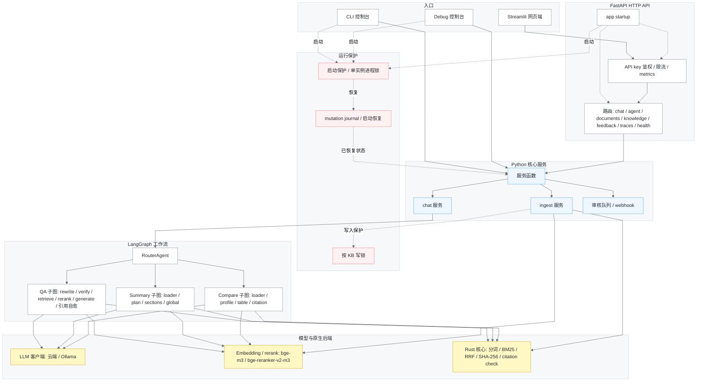

CLI 和 Debug 会绕过 FastAPI HTTP 适配层，直接在同一进程内调用 Python 核心服务；内置 Streamlit 网页端才通过 HTTP/SSE 访问 FastAPI。CLI、Debug 和 FastAPI 都会在启动时获取单实例进程锁，并先恢复 mutation journal，再处理知识库变更。

下图展开入库、检索和本地持久化的边界：PDF 内容与已审核派生知识分别建索引，查询时再汇入同一候选池；反馈不会直接改写索引，而是先沉淀为可审核记录或可回滚的检索调权。

**索引、检索与存储**

**索引与变更链路**

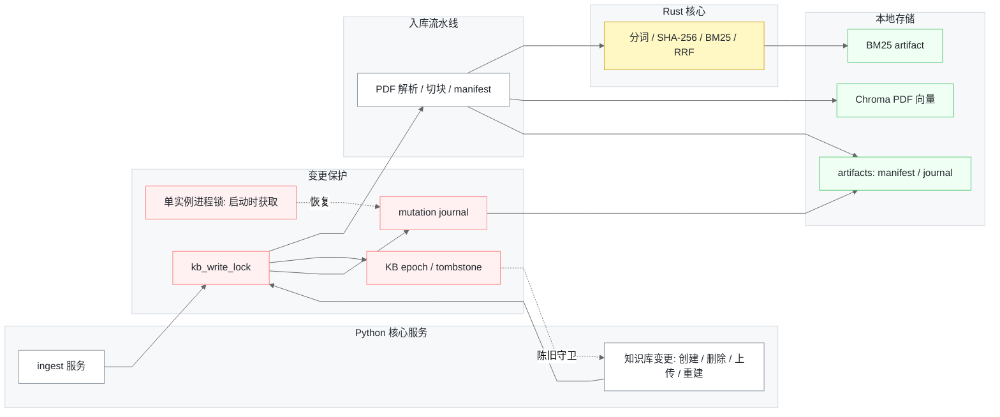

**QA 检索链路**

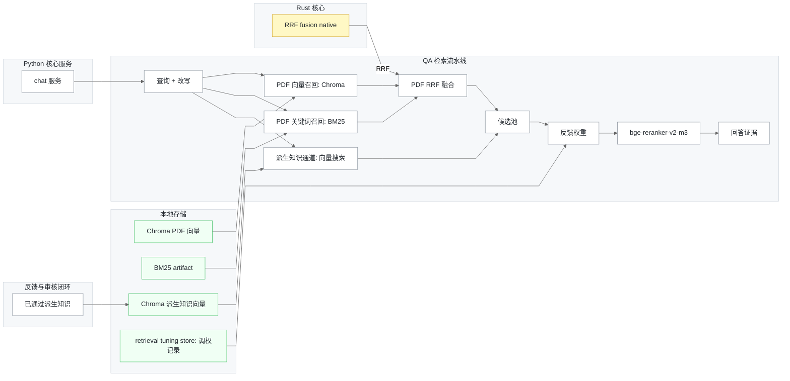

**反馈、审核与持久化链路**

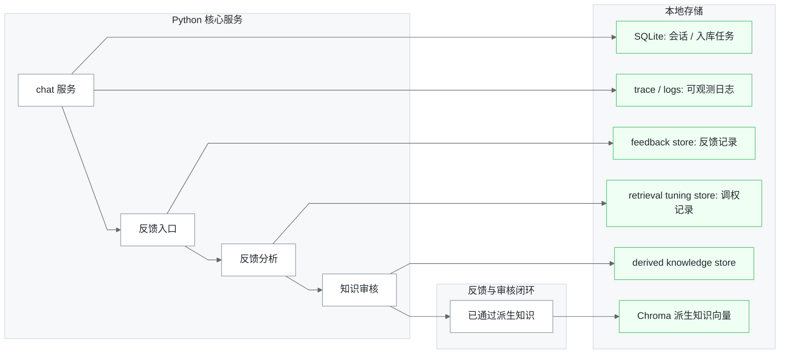

Summary 为单个点名文档生成固定章节结构化摘要；Compare 为每篇文档在固定维度上建 profile，再按维度渲染带引用的 Markdown 对比块。两者都从 chunk 元数据确定性地绑定 `[source:Pn]` 引用，并跑与 QA 同一套 `validate_citations_native` 校验。

Python 层负责图编排、Prompt、模型客户端、索引、CLI 控制台、独立 Debug 控制台以及 FastAPI/Streamlit 前端。已通过的派生知识在 Python 层存储和审核，单独写入 Chroma，并作为 QA 的独立证据源参与检索；待审核、过期、驳回和归档知识不会进入召回。Rust 层（`rust_core`）负责确定性 kernel，不随 Agent 逻辑漂移，并独立做单元测试。

## 索引链路

由 `build_kb_index_transactional` 在某个库的文件变更时驱动（`/add`、`/rm` 或云端上传/删除接口）：

1. **扫描** — `scan_pdf_manifest_native`（Rust）用 rayon 并行、1 MiB 缓冲的 SHA-256 计算每个 PDF，返回 `{doc_id, documents: [{name, size, sha256}]}`，按文件名排序。
2. **比对** — `manifests_match` 仅当 `doc_id`、`chunk_identity_version` 及每个 `{name, sha256}` 都与已存 manifest 一致时才复用索引；任一不匹配都强制重建。
3. **解析** — `smart_parse`（PyMuPDF）抽取页文本，并按文本块中心 x 坐标重排双栏布局。开启可选 OCR 后，低文本页面会在页数与超时预算内渲染并交给本地 Tesseract 识别；未开启时仍标记为 `is_ocr_fallback`，且只保留原生文本结果。
4. **切块** — `chunk_paper` 以 600 字符为硬上限、60 字符 overlap（最小 30）切过页文本流；边界优先按段落、句末标点/分号、换行/空白确定，超长无边界文本才退回固定窗口。每个 chunk 会保存前后最多 160 字符的定位上下文，通过 `bisect` 映射回页跨度，并赋予稳定的 `chunk_id`。
5. **建索引** — chunk 写入 Chroma（向量）和 BM25 持久化 artifact；BM25 artifact 保存精简 chunk registry 与 native `Bm25Index` 字节，加载时直接从字节恢复 native 索引，不再从 Python 分词语料重建。`save_index_manifest` 落盘 manifest。分词走 `tokenize_mixed_text_native` / `tokenize_corpus_native`（中文 `jieba-rs`，英文 Snowball 词干化 + 停用词过滤）。

已审核派生知识与 PDF 源文档分开建索引。审核状态变化后可重建派生知识 Chroma collection，过期扫描会标记那些来源绑定已不再匹配当前知识库文档的知识。

**Chunk 身份契约：**

```
chunk_id = sha256:{source_sha256}:src:{source_name}:p{page_start}-p{page_end}:c{local_chunk_index}
```

`chunk_id` 是贯穿 chunker、index、retriever、RRF、evidence 的唯一稳定身份键——去重和融合从不依赖数组下标。它带版本（`chunk_identity_version = source_sha256_name_page_span_local_v3_semantic_cs600_ov60_min30_ctx160`）；改动切块边界必须 bump `CHUNK_IDENTITY_BASE_VERSION`，让旧索引重建而非混用两套方案。

## 查询链路

- **意图路由** — `RouterAgent` 要求 LLM 返回结构化 `task_type ∈ {qa, summary, compare, unknown}`，任何解析异常都按关键词规则回退。`qa`、`summary`、`compare` 都已接到真实子图。
- **改写 + 漂移守卫** — `QueryRewriteAgent` 生成 1–3 条关键词查询（pydantic 结构化输出）。`RewriteVerifyAgent` 一次批量 embed `[原问题] + 改写`，保留 `cosine >= rewrite_similarity_threshold`（默认 `0.5`）的改写，把保留/丢弃写入 `steps_trace`；若全被丢弃则只用原问题。
- **混合检索 + RRF** — 每条 query 下 PDF 两路各超召 `top_k * 3`（QA 用 `top_k = 9` → 每路 27）；`rrf_fusion_native`（Rust，`k = 60`）计算 `score(d) = Σ_c 1 / (k + rank_c(d))`，合并共享同一 `chunk_id` 的命中，并按分数降序、身份键升序排序保证确定性。已通过派生知识会按原问题/改写问题单独检索并并入同一证据池，随后应用反馈生成的检索调权，再进入重排。
- **重排** — `BGEReranker`（`bge-reranker-v2-m3`）对 `(原问题, doc)` 打分并取 `top_n = 3`；改写不会影响最终排序。
- **生成 + 引用自愈** — `Generator`（OpenAI 兼容；云端 `deepseek-chat` 或本地 `qwen2.5:7b`，`temperature = 0.2`）把文档包装为 `<Document source=… page=… chunk_id=…>` 并强制 `[source:Pn]` 标签。`validate_citations_native`（Rust）返回结构化的 `missing_citations` / `invalid_sources` / `invalid_pages`；`citation_node` 把失败转成 critique，循环 `generate → citation` 至 `max_iteration_count`（默认 `2`）。只有通过校验的回答才会打印。

**Summary 子图** — `document_loader` 选定一个点名文档（若语料库只有一篇则可自动选中；多文档歧义 query 返回可操作提示），`section_planner` 默认固定为背景与目标、方案与流程、规则与要求、价值与产出、限制与注意事项五个章节（也可由 state 传入自定义标题），`section_summary` 逐章节生成一段短摘要（模型只写正文，`[source:Pn]` 由程序按所用 chunk 确定性绑定），`global_summary` 整合答案并复跑引用校验。无依据章节不带引用、不带 evidence。

**Compare 子图** — `document_loader` 要求显式点名至少 2 篇文档；本地 Ollama 模式最多同时对比 2 篇。`document_profile` 在固定维度上逐文档建 profile（云端：方法/数据/指标/优点/限制/适用场景；本地：方法/数据/指标/限制），并复用 Summary 的 cell 原语。`compare_table` 渲染 Markdown 对比块；云端模式会额外生成一段受控短结论，本地模式跳过这次额外调用以降低内存压力。`compare_citation_node` 先单独校验结论，再校验对比块；任一失败都降级为纯对比块并附警告。全无依据的对比不会被误判为缺引用。

## Rust 原生核心

`rust_core` 是 PyO3/maturin 扩展，通过 `tools.rust_core_loader.ensure_rust_core` 加载；若构建缺失或符号过期，会尽早失败并给出 `maturin develop` 提示。共暴露六个 native 符号，全部登记在 `scripts/check_native.py`，使 `make check` 能对旧构建报错。

| 符号 | 模块 | 用途 |
| --- | --- | --- |
| `scan_pdf_manifest_native` | `scanner.rs` | rayon 并行、缓冲式 SHA-256 计算所有 PDF；size + 哈希 manifest，稳定排序 |
| `rrf_fusion_native` | `rrf.rs` | 对 vector + BM25 结果做确定性 RRF（`k=60`）融合，以 `chunk_id` 为键 |
| `validate_citations_native` | `citation.rs` | 结构化引用校验 → `invalid_sources` / `invalid_pages` / `missing_citations` |
| `tokenize_mixed_text_native` | `tokenizer.rs` | 中英混合分词：中文走 `jieba-rs`，英文做 Snowball 词干化 + 停用词过滤（标识符/版本号原样保留），与 Python 参照逐 token 对齐 |
| `tokenize_corpus_native` | `tokenizer.rs` | BM25 建库使用的批量语料分词，避免 Python 侧逐文档分词循环 |
| `Bm25Index`（类） | `bm25.rs` | BM25 索引 + `score_topk` + native 字节持久化，与 `rank_bm25.BM25Okapi` 逐位对齐，top-k 在 native 端选出 |

## 项目结构

```text
CogDoc/
├── src/cogdoc/
│   ├── cli.py
│   ├── debug.py
│   ├── agents/
│   ├── api/
│   │   └── routes/
│   ├── config/
│   ├── frontend/
│   ├── graph/
│   │   └── subgraphs/
│   ├── observability/
│   ├── service/
│   └── tools/
│       └── retriever/
├── rust_core/src/
├── scripts/
├── tests/
├── eval/
├── docs/
└── pyproject.toml
```

| 路径 | 负责内容 |
| --- | --- |
| `src/cogdoc/cli.py` | 多知识库、多对话命令行入口（`python -m cogdoc.cli` / `cogdoc`） |
| `src/cogdoc/debug.py` | 独立 Trace Debug 控制台（`python -m cogdoc.debug` / `cogdoc-debug`） |
| `src/cogdoc/agents/` | 路由、问题改写、生成、引用校验、反馈理解，以及 Summary / Compare 的 Agent 原语 |
| `src/cogdoc/api/` | FastAPI app、路由、schema、持久化、访问控制、metrics、feedback / knowledge store、webhook |
| `src/cogdoc/frontend/` | Streamlit 瘦客户端和 API client |
| `src/cogdoc/graph/` | LangGraph 状态、主 workflow、QA / Summary / Compare 子图 |
| `src/cogdoc/service/` | chat / ingest 服务、KB 生命周期、事务化索引、锁、清理和后台任务 |
| `src/cogdoc/tools/` | PDF 解析、切块、manifest、embedding、rerank、Rust loader 和检索器 |
| `rust_core/src/` | PyO3 原生内核：scanner、tokenizer、BM25、RRF、citation validator |
| `scripts/`、`tests/`、`eval/`、`docs/` | 健康检查脚本、测试、离线评测集和项目文档 |

## 扫描 PDF OCR（可选）

OCR 是摄取阶段的可选降级路径，不会替代 PDF 原生文本提取。CogDoc 会先读取每页文本层；空白归一化后，字符数少于 `COGDOC_OCR_MIN_NATIVE_CHARS` 的页面才会成为 OCR 候选页，达到阈值的页面不会渲染。候选页由项目已有的 PyMuPDF 渲染，再交给本机 Tesseract CLI 识别。

Docker 镜像已安装 Tesseract 以及 `eng`、`chi_sim` 语言包。本机使用 Debian/Ubuntu 时可执行：

```bash
sudo apt-get install tesseract-ocr tesseract-ocr-eng tesseract-ocr-chi-sim
tesseract --list-langs
```

其他系统请安装 Tesseract 可执行文件和 `COGDOC_OCR_LANGUAGES` 所需语言数据；若命令不在 `PATH`，将 `COGDOC_OCR_BINARY` 设为可执行文件路径。不需要额外安装 Python OCR 包。

```dotenv
COGDOC_OCR_ENABLED=true
COGDOC_OCR_PROVIDER=tesseract
COGDOC_OCR_BINARY=tesseract
COGDOC_OCR_LANGUAGES=eng+chi_sim
COGDOC_OCR_DPI=300
COGDOC_OCR_MIN_NATIVE_CHARS=40
COGDOC_OCR_MAX_PAGES=100
COGDOC_OCR_PAGE_TIMEOUT_SECONDS=30
COGDOC_OCR_REQUIRED=false
```

`COGDOC_OCR_MAX_PAGES` 限制每份文档尝试 OCR 的候选页数，`COGDOC_OCR_PAGE_TIMEOUT_SECONDS` 限制每页 Tesseract 调用时间。提高 DPI 可能改善小字识别，但会增加 CPU 和内存开销。`COGDOC_OCR_REQUIRED=false` 时，命令缺失、语言包缺失、超时或 OCR 非零退出都会让该页降级为原生文本结果，摄取继续；设为 `true` 时，同类问题会让摄取失败，避免不完整的扫描文档被静默接收。

页面渲染和识别发生在 CogDoc 进程及本地 Tesseract 子进程中，不会把页面图像发送给托管 OCR 服务。但识别出的文本仍会进入现有的向量化和 LLM 流程，因此使用云端模型时，数据边界与现有云端路径相同。对于不可信 PDF，只有在部署能够承担额外 CPU、内存和子进程开销时才应开启 OCR。

`GET /health/ready` 会把 OCR 作为独立 component 返回，默认状态为 `disabled`。开启 OCR 但找不到可执行文件时，可选 OCR（`COGDOC_OCR_REQUIRED=false`）会报告 `degraded`，但服务整体仍为 ready；必需 OCR（`COGDOC_OCR_REQUIRED=true`）会让 readiness 返回 HTTP 503。可执行文件检查通过后的单页识别失败遵循上文的摄取语义，不会反向改变 readiness。

## 配置

| 变量 | 默认值 | 作用 |
| --- | --- | --- |
| `COGDOC_DOC_DIR` | `your_documents` | 收件箱目录，`/add` 从这里把 PDF 选入知识库 |
| `COGDOC_DATA_DIR` | `./data` | 知识库状态、SQLite、manifest 和索引产物根目录 |
| `COGDOC_TRACE_ENABLED` | `true` | 是否导出请求 JSON trace |
| `COGDOC_TRACE_DIR` | `logs/traces` | trace JSON 文件目录 |
| `COGDOC_WEBHOOK_URL` | 未设置 | 待审核知识事件的可选回调地址 |
| `COGDOC_WEBHOOK_SECRET` | 未设置 | 回调请求携带的可选共享密钥 |
| `COGDOC_WEBHOOK_TIMEOUT_SECONDS` | `3` | 回调投递请求超时时间 |
| `COGDOC_FEEDBACK_STORE` | `jsonl` | 反馈存储后端；设为 `sqlite` 时使用数据库并导出逐行对象副本 |
| `COGDOC_DERIVED_KNOWLEDGE_INDEX_AUTO_REFRESH` | `false` | 知识审核变更后在后台重建派生知识向量索引 |
| `COGDOC_API_KEYS` | 未设置 | 逗号分隔的 API key；为空则关闭 API 鉴权 |
| `RATE_LIMIT_PER_MINUTE` | `120` | 受保护 API 路由的令牌桶补充速率 |
| `RATE_LIMIT_BURST` | `120` | 令牌桶突发容量；`<=0` 表示关闭限流 |
| `COGDOC_MAX_UPLOAD_MB` | `50` | 网页/API 上传 PDF 的单文件大小上限 |
| `QA_ABSTAIN_ENABLED` | `true` | 检索置信度不足时在调用 LLM 前确定性拒答 |
| `QA_ABSTAIN_MAX_VECTOR_DISTANCE` | `0.86` | 可接受的归一化向量 L2 距离上限 |
| `QA_ABSTAIN_MIN_BM25_SCORE` | `10.0` | 可独立证明检索支持度的 BM25 分数下限 |
| `QA_ABSTAIN_MIN_KNOWLEDGE_SCORE` | `0.5` | 已审核派生知识的支持度下限 |
| `QA_EVIDENCE_VERIFY_ENABLED` | `true` | 答案生成前对精确事实问题执行证据充分性校验 |
| `QA_EVIDENCE_VERIFY_MAX_DOCS` | `3` | 证据校验器最多使用的来源去重文本块数 |
| `QA_EVIDENCE_VERIFY_MAX_CHARS_PER_DOC` | `1600` | 每个校验文本块的字符上限 |
| `QA_EVIDENCE_VERIFY_BORDERLINE_MIN_SCORE` | `0.75` | 允许二阶段校验尝试救回的一阶段最低支持度 |
| `OLLAMA_BASE_URL` | `http://localhost:11434/v1` | 本地 OpenAI 兼容 Ollama endpoint |
| `OLLAMA_MODEL_NAME` | `qwen2.5:7b` | 本地模型名 |
| `OLLAMA_TIMEOUT_SECONDS` | `180` | 本地模型请求超时 |
| `LLM_BASE_URL` | `https://api.deepseek.com/v1` | 云端 OpenAI 兼容 endpoint |
| `LLM_MODEL_NAME` | `deepseek-chat` | 云端模型名 |
| `LLM_API_KEY` | `your-cloud-api-key-here` | 云端 API key |
| `LLM_TIMEOUT_SECONDS` | `90` | 云端模型请求超时 |
| `LLM_<NODE>_BACKEND` | `default` | 节点级后端：`default`、`cloud` 或 `local` |
| `LLM_<NODE>_MODEL_NAME` | 未设置 | 节点级云端模型覆盖 |
| `OLLAMA_<NODE>_MODEL_NAME` | 未设置 | 节点级本地模型覆盖 |
| `HF_TOKEN` | 未设置 | 可选 Hugging Face Hub token |

`<NODE>` 可取 `ROUTER`、`QUERY_REWRITER`、`SOURCE_RESOLVER`、`EVIDENCE_VERIFIER`、`QA_GENERATOR`、`SUMMARY_GENERATOR`、`COMPARE_PROFILE` 或 `COMPARE_CONCLUSION`。例如，可设置 `LLM_EVIDENCE_VERIFIER_BACKEND=local` 和 `OLLAMA_EVIDENCE_VERIFIER_MODEL_NAME=<校验模型>`，让证据校验与云端答案生成使用不同模型。引用格式及来源/页码合法性仍由 Rust 确定性校验，不交给 LLM。

环境要求：Python 3.11+（在 3.13 上开发；扩展目标 3.8+）、带 `cargo` 的 Rust 工具链（edition 2024，经 [rustup](https://rustup.rs/)）、[maturin](https://www.maturin.rs/)。可选：[Ollama](https://ollama.com/) 用于本地模型。完整可调项见 `.env.example`（检索 `top_k`、重排 `top_n`、RRF `k`、CUDA 显存下限、评测集路径等）。

## 开发与测试

| 命令 | 说明 |
| --- | --- |
| `make native` | 构建 / 重建 `rust_core`（改过 `.rs` 必跑） |
| `make check` | 校验扩展可导入且 native 符号齐全 |
| `make test` | 运行 Python 测试 |
| `make smoke-api` | 运行不依赖真实模型/索引的 API smoke |
| `make backup` | 备份本地运行状态到 `backups/` |
| `make eval` | 运行离线检索评测（`recall@k`、MRR） |
| `make eval-coverage` | 不执行真实检索，只检查检索评测集覆盖面 |
| `make eval-retrieval-report` | 按 100 条真实检索配置运行并写入报告 |
| `make eval-retrieval-baseline` | 生成经复核的真实检索基线 |
| `make eval-retrieval-gate` | 执行绝对阈值门禁并对比检索基线 |
| `make eval-quality` | 运行离线质量评测（路由、引用、人工忠实性台账） |
| `make eval-quality-coverage` | 运行质量指标并检查覆盖维度 |
| `make eval-suite` | 运行组合评测门禁（覆盖审计 + 质量指标） |
| `make eval-suite-run-retrieval` | 运行组合评测并执行真实检索指标 |
| `make eval-suite-report` | 写入 `eval/eval_suite_report.json` |
| `make eval-suite-baseline` | 对比 `eval/eval_suite_baseline.json` |
| `make eval-suite-update-baseline` | 复核后刷新 `eval/eval_suite_baseline.json` |
| `make run` | 启动交互式 CLI 控制台 |
| `make serve` | 启动 FastAPI 服务（`uvicorn cogdoc.api.app:app`） |
| `make frontend` | 启动 Streamlit 网页端 |
| `make debug` | 启动独立 Debug 控制台 |
| `cd rust_core && cargo test` | 运行 Rust 单元测试 |
| `cd rust_core && cargo fmt --check` | 检查 Rust 代码格式 |

测试分层：业务逻辑与 Python↔native API 契约用 Python 覆盖（`tests/`）；纯 Rust 逻辑用 `rust_core/src/` 里的 Rust `#[test]`。依赖 native 的 Python 测试在未构建时会 `importorskip` 跳过，完整回归前请先 `make native`。

离线评测使用 `eval/` 下的本地 JSONL。`make eval-suite` 是默认轻量门禁：它会审计检索和质量评测集覆盖，运行质量指标，按用例类型和层级输出摘要，默认跳过依赖模型的真实检索。`make eval-suite-report` 写入 `eval/eval_suite_report.json`；`make eval-suite-baseline` 对比 `eval/eval_suite_baseline.json` 的聚合指标、类型指标和分层质量指标；`make eval-suite-update-baseline` 在复核后刷新这份基线。生成的报告和基线文件都被 Git 忽略。

真实检索配置要求 `eval/retrieval_eval.jsonl` 至少包含 100 条已复核问题：单源 40 条、多源 20 条、困难 20 条、无答案 20 条。`make eval-retrieval-baseline` 记录复核后的参考运行；`make eval-retrieval-gate` 对比相关性基线，并执行本地 `eval/retrieval_gate.json` 中的绝对阈值，文件结构参考 `eval/retrieval_gate.example.json`。报告会给出整体和分层的 MRR/Recall/Hit、平均延迟与 P95 延迟；模型加载和首轮初始化会单独记为 warmup，不计入稳态延迟。`answerable_acceptance_rate` 和 `no_answer_abstention_rate` 直接衡量确定性一阶段门禁。被一阶段放行的精确事实问题，以及支持度高于 `QA_EVIDENCE_VERIFY_BORDERLINE_MIN_SCORE` 的边界候选，会在生成前进入结构化证据充分性校验。无答案样本还会报告 `no_answer_false_positive@k`，该指标只表示检索器是否返回候选，不代表任一门禁已放行，也不能等同于生成答案已产生事实错误。默认的向量距离/BM25 阈值由本地已复核集标定，更换语料或嵌入模型后应重新标定。

`make eval` 对本地检索集做临时评测；干净 checkout 没有本地集时会回退到 `eval/retrieval_eval.example.jsonl`。`make eval-coverage` 不触碰索引，只检查 smoke 覆盖配置。组合评测需要真实检索时运行 `make eval-suite-run-retrieval`。`make eval-quality` 会统计路由准确率、引用准确率和覆盖 QA、Summary、Compare、多轮、无答案、反馈层级的人工忠实性台账；`make eval-quality-coverage` 还会对必需 case type 和推荐 layer 执行覆盖门禁。点踩/纠错会在 `bad_cases.jsonl` 写入 `eval_draft`，方便复核后提升到质量评测集。只想检查质量覆盖时运行 `python scripts/eval_quality.py --coverage-only`。`--coverage-only` 有意不允许与 `--check-coverage`、`--json`、`--baseline` 同时使用。

运行 `python scripts/eval_retrieval.py --rerank --verify-evidence` 可把云端证据校验纳入最终放行率/拒答率统计；加 `--local-verifier` 则使用 Ollama。该模式会发起模型调用，因此有意不纳入默认检索门禁。

每次对话都会生成 `request_id` / `trace_id`。`COGDOC_TRACE_ENABLED=true` 时，服务会把 JSON trace 写入 `COGDOC_TRACE_DIR`（默认 `logs/traces`），同一份安全载荷也可通过 `GET /v1/traces/{trace_id}` 查询；`GET /v1/traces` 可按 `doc_id` 和 `session_id` 限定范围，Streamlit Trace 面板正是用它只展示当前对话。trace 文件包含 `schema_version`、`status`（`ok`、`degraded` 或 `failed`）、总 `duration_ms`、安全配置快照、步骤摘要、改写摘要、错误摘要，并且只保存截断后的 evidence preview，不写入完整文档正文。独立 Debug 控制台读取同一套 trace 格式。

备份恢复和索引重建规则见 [PRODUCTION_zh-CN.md](PRODUCTION_zh-CN.md)。

## 已知限制

- **OCR 是默认关闭的 Tesseract MVP。** 仅支持本机已安装的语言包，不提供托管 OCR provider；识别质量取决于扫描质量、语言选择和 DPI。
- Summary 与 Compare 是固定 schema MVP：云端模式会并发执行相互独立的章节/维度 LLM cell，并保持输出顺序稳定；本地 Ollama 模式为避免内存压力仍走串行。默认章节/维度集合固定，除非通过 graph state 传入自定义配置。
- 本地 Compare 有意限制为 2 篇文档、4 个核心维度，并跳过额外结论生成，以降低 Ollama 内存压力。
- Citation 校验只证明引用的 `source` 和 `page` 物理合法，不证明整句话语义完全正确，也不强制每句都带引用。
- Rewrite 相似度阈值默认 `0.5`，后续应基于真实数据标定。
- 本地模型下载依赖网络或已有 Hugging Face 缓存。

## 故障排查

- `Rust 扩展 rust_core 未安装` / `缺少: …` — 运行 `make native`，再 `make check`。
- 改了 Rust 但行为没变 — 没有重新构建，旧 `.so` 仍在被加载。运行 `make native`。
- `Model Mismatch!` — 索引的 embedding 模型与 `Embedder.MODEL_NAME` 不一致；重建索引（清空该 `doc_id` 的 Chroma collection 或更换 `doc_id`）。
- Streamlit 连不上后端 — 先 `make serve` 起服务，并检查侧栏的 **后端地址**（默认 `http://localhost:8000`）。
- Hugging Face 匿名限额提示 — 设置 `HF_TOKEN` 提高 Hub 限额；公开模型通常不设置也能下载。

## 许可证

[MIT](../LICENSE)
