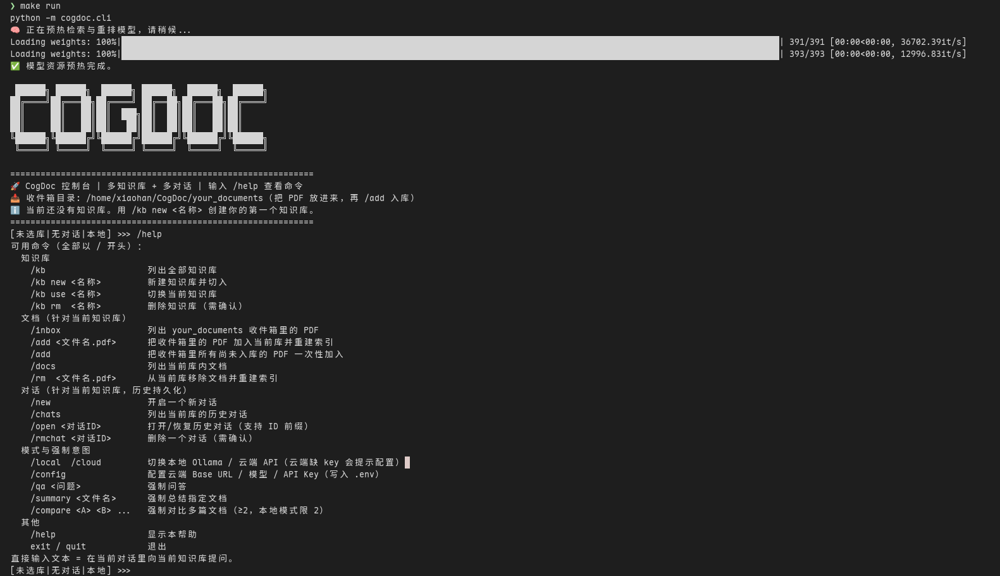
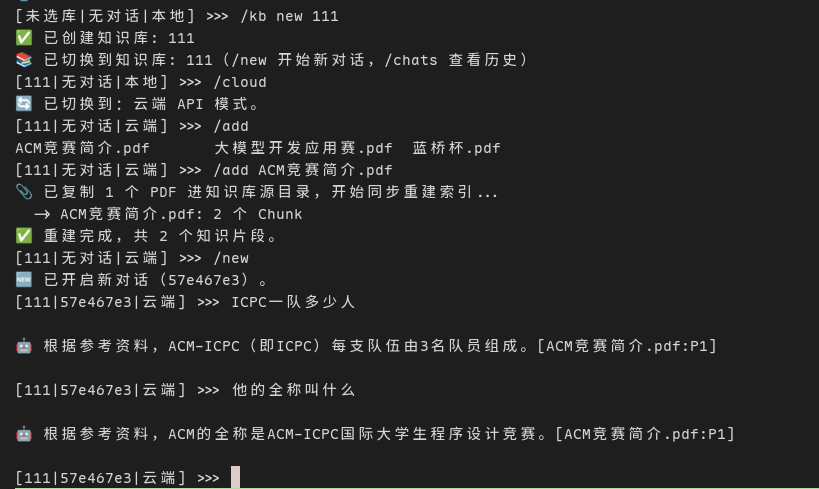
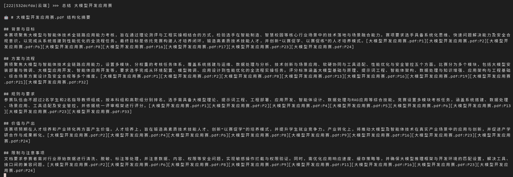
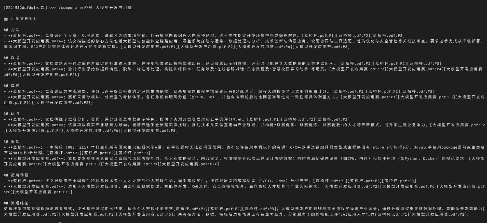
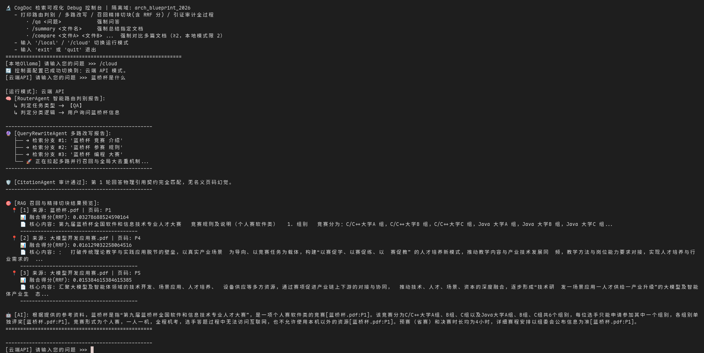

# CogDoc

> ⭐ **如果 CogDoc 对你有帮助，欢迎点个 Star** — 这是项目持续迭代和加新功能的动力。

[English](../README.md) · [简体中文](README_zh-CN.md)

一个面向个人 / 企业的本地 RAG 知识库控制台，上层是 **LangGraph 多 Agent 编排**，底层是**确定性 Rust 核心（PyO3 + maturin）**。它能在你自己的 PDF 知识库上做问答、总结单篇文档、对比多篇文档——而且每条生成结论都会绑定回 `[source:Pn]` 引用，并且这个引用是**经过校验的，而非默认可信**。你可以用**命令行控制台**，也可以用基于 FastAPI 服务的 **Streamlit 网页端**。

> ⚠️ **目前仅支持带文字层的 PDF——暂未做 OCR。** 解析只抽取文本层；疑似扫描版/纯图片的页面会被标记（`is_ocr_fallback`）并跳过，不做识别。请使用包含真实文本的 PDF。

## 功能特点

- **带可验证引用的问答** — 生成被约束在召回的文档块内；捏造的文件/页码标签会被 Rust 校验器抓出，并在自愈循环里重新生成。

- **单文档结构化摘要** — 固定章节，引用从 chunk 元数据确定性绑定。

- **多文档对比** — 在固定维度上逐文档建 profile，按维度渲染带引用的对比块。

- **混合检索、native 打分** — 向量（Chroma + 多语言 BGE-M3）与 BM25 两路召回由 Rust RRF kernel 融合；分词与 BM25 均为 native——中文走 `jieba-rs`，英文做小写化 + Snowball 词干化 + 停用词过滤，中英文都召得回。

- **内容寻址的增量缓存** — 逐文件 SHA-256 manifest 加带版本的 chunk 身份契约：未变化的文件直接复用已建索引，只有 PDF 内容或切块方案真正变化时才增量重建。

- **多知识库 · 多对话 · 持久记忆** — 每个知识库可并行开多个对话；历史落 SQLite 持久化（长期记忆），刷新或重启都不丢、可随时回放。每次提问自动带上最近对话窗口（短期记忆，默认末 12 条消息）做多轮对话与指代消解，且只有通过引用校验的回答才写入记忆，避免错误答案污染后续轮次。

- **两套前端** — 斜杠命令的 CLI 控制台，以及基于 FastAPI 后端、支持流式/历史/引用/反馈的 Streamlit 网页端。

  

1. **网页端对话（Streamlit）。** 选一个知识库，自然语言提问，看着答案流式生成，再展开引用来源和证据片段，并打 👍/👎 反馈。

   

2. **命令行控制台。** 用斜杠命令管理知识库、入库和多对话历史。

   

3. **带引用的问答。** 每条事实性句子都以引用结尾，且引用的文件名和页码必须存在于本轮检索上下文中；非法引用会把回答打回重新生成。

   

   

4. **结构化摘要。** 把一篇点名文档总结为固定章节，每节带确定性引用。

   

   

5. **多文档对比。** 对两篇或更多点名文档逐方法、逐指标对比，每个单元格都带引用。

   

   

6. **检索调试控制台。** 针对单个库可视化路由判别、问题改写、召回+精排切块（含 RRF 分）与引证审计。

   

## 快速开始

```bash
python -m venv .venv
source .venv/bin/activate
pip install -e ".[dev]"   # 运行时 + 构建/测试依赖（可编辑安装，src-layout）
make native     # 构建 Rust 扩展：cd rust_core && maturin develop --release
make check      # 校验扩展及其 native 符号
make run        # 构建/复用索引、预热模型、启动控制台
```

依赖统一在 [pyproject.toml](../pyproject.toml)：运行时依赖在 `[project.dependencies]`，`dev`（构建/测试）与 `frontend`（Streamlit 客户端）为可选 extras，用 `.[dev]` / `.[frontend]` 安装。包采用 `src/` 布局（`src/cogdoc/`）；`make` 目标会把 `src/` 加入 `PYTHONPATH`，因此跑测试无需先安装。

把 `.env.example` 复制为 `.env`，至少设置云端 `LLM_API_KEY`（或用 `/local` 走 Ollama）。把 PDF 放进收件箱 `your_documents/`（或设置 `COGDOC_DOC_DIR`）。每次修改 `rust_core/src/` 下的代码后都必须重跑 `make native`——`.so` 不会自动重建，也不纳入版本控制。

## 使用流程

两套前端共用同一条 建库 → 入库 → 提问 流程。先按[快速开始](#快速开始)装一次环境：安装依赖、构建原生扩展（`make native && make check`）、配置 `.env`、把 PDF 放进 `your_documents/`。

### 命令行控制台

```bash
make run            # python -m cogdoc.cli
```

之后在控制台里用斜杠命令完成全部操作：

1. `/kb new <名称>` — 建知识库，`/kb` 列出/切换。
2. `/add <文件.pdf>` — 把收件箱 `your_documents/` 里的 PDF 加入当前库（同步重建索引）。
3. `/new` — 开新对话；`/chats`、`/open` 浏览持久化历史。
4. 直接提问走 **QA**；"总结 `<文件>`" 走 **Summary**；"对比 `<a>` 和 `<b>`" 走 **Compare**。
5. `/cloud` 用云端 LLM，`/local` 用 Ollama；`/help` 列出全部命令；`exit` 退出。

`make debug` 打开针对单个库的检索可视化控制台。

### 网页端（Streamlit + FastAPI）

```bash
make serve          # 终端 1：FastAPI，地址 http://localhost:8000
make frontend       # 终端 2：Streamlit 网页端（自动在浏览器打开）
```

在浏览器里：

1. **侧栏 → 知识库** — 新建一个库，或选择已有的库。
2. **侧栏 → 文档** — 上传 PDF 并入库；进度面板会轮询后台入库任务直到完成。
3. **对话** — 新建对话或重开历史对话（会话和知识库持久化进 URL，刷新后续上同一对话）。
4. **聊天** — 选模式（`auto` / `qa` / `summary` / `compare`），提问，读流式答案及其引用来源、证据片段和 👍/👎 反馈。
5. 在侧栏打开 **本地 Ollama 模式** 即可把生成切到本地模型。

### 直接调用 API

Streamlit 前端只是 FastAPI 服务上的瘦客户端——你也可以直接调用：

| 端点 | 用途 |
| --- | --- |
| `POST /v1/knowledge-bases`、`GET /v1/knowledge-bases` | 创建 / 列出知识库 |
| `POST /v1/knowledge-bases/{kb}/documents` | 上传 + 入库 PDF（返回异步 `job_id`） |
| `GET /v1/index-jobs/{job_id}` | 轮询入库进度 |
| `POST /v1/chat`、`POST /v1/chat/stream` | 提问（JSON 或 SSE 流式） |
| `GET /v1/sessions`、`GET /v1/sessions/{id}/history` | 列出 / 回放对话历史 |
| `POST /v1/feedback` | 按 `trace_id` 提交赞/踩 |
| `GET /healthz`、`GET /readyz`、`GET /metrics` | 健康、就绪、Prometheus 指标 |

若配置了 API key，请求会被鉴权并限流；不配 key 时 `/v1` 对外开放（服务启动时会打告警日志）。

## 技术栈

- **确定性内核** — 自研 [Rust](https://www.rust-lang.org/) 扩展（[PyO3](https://pyo3.rs/) + [maturin](https://www.maturin.rs/)）扛下 `jieba-rs` 中英分词、BM25、RRF 融合、SHA-256 manifest 与引用校验，全部 native、独立单测，不随 Agent / Prompt 漂移。
- **检索** — `bge-m3` 多语言向量召回 + BM25 关键词召回，Rust RRF 融合后再用 `bge-reranker-v2-m3` 精排；向量落 [Chroma](https://www.trychroma.com/)，PDF 解析走 PyMuPDF。
- **编排** — [LangGraph](https://langchain-ai.github.io/langgraph/) 把路由 → 改写 → 检索 → 生成 → 引用自愈串成可循环的状态图。
- **模型** — OpenAI 兼容双后端、一键热切：云端 DeepSeek，本地 Ollama `qwen2.5:7b`。
- **服务** — FastAPI 提供 SSE 流式接口，会话 / 入库任务 / 反馈落 SQLite；Streamlit 作瘦客户端。

## 架构

```text
user question
  -> intent_router (qa | summary | compare | unknown)
  -> QA subgraph
       rewrite_node          QueryRewriteAgent: 1–3 条关键词查询
    -> verify_rewrite_node   RewriteVerifyAgent: cosine 漂移过滤
    -> retrieve_node         HybridRetriever: 每条 query 走 Vector + native BM25，Rust RRF 融合
    -> rerank_node           BGEReranker: cross-encoder 取 top_n
    -> generate_node         Generator: 带 [source:Pn] 标签的受约束回答
    -> citation_node         CitationValidatorAgent: Rust 校验 + Python critique
       (generate <-> citation 循环至 max_iteration_count，否则 END)
  -> Summary 子图            document_loader -> section_planner -> section_summary -> global_summary
  -> Compare 子图            document_loader -> document_profile -> compare_table -> citation
```

Summary 为单个点名文档生成固定章节结构化摘要；Compare 为每篇文档在固定维度上建 profile，再按维度渲染带引用的 Markdown 对比块。两者都从 chunk 元数据确定性地绑定 `[source:Pn]` 引用，并跑与 QA 同一套 `validate_citations_native` 校验——任何子图都不豁免。

Python 层负责图编排、Prompt、模型客户端、索引、CLI 控制台以及 FastAPI/Streamlit 前端。Rust 层（`rust_core`）负责确定性 kernel，不随 Agent 逻辑漂移，并独立做单元测试。

## 索引链路

由 `build_kb_index_transactional` 在某个库的文件变更时驱动（`/add`、`/rm` 或云端上传/删除接口）：

1. **扫描** — `scan_pdf_manifest_native`（Rust）用 rayon 并行、1 MiB 缓冲的 SHA-256 计算每个 PDF，返回 `{doc_id, documents: [{name, size, sha256}]}`，按文件名排序。
2. **比对** — `manifests_match` 仅当 `doc_id`、`chunk_identity_version` 及每个 `{name, sha256}` 都与已存 manifest 一致时才复用索引；任一不匹配都强制重建。
3. **解析** — `smart_parse`（PyMuPDF）抽取页文本，按文本块中心 x 坐标重排双栏布局，对疑似扫描页打 `is_ocr_fallback` 标记。不做 OCR；被标记的页不贡献任何文字。
4. **切块** — `chunk_paper` 以 600 字符 / 60 重叠（最小 30）滑窗切过页文本流，通过 `bisect` 把每个 chunk 映射回页跨度，并赋予稳定的 `chunk_id`。
5. **建索引** — chunk 写入 Chroma（向量）和 pickle 持久化的分词语料；加载时由 native `Bm25Index` 从该语料重建。`save_index_manifest` 落盘 manifest。分词走 `tokenize_mixed_text_native`（中文 `jieba-rs`，英文 Snowball 词干化 + 停用词过滤）。

**Chunk 身份契约：**

```
chunk_id = sha256:{source_sha256}:p{page_start}-p{page_end}:c{local_chunk_index}
```

`chunk_id` 是贯穿 chunker、index、retriever、RRF、evidence 的唯一稳定身份键——去重和融合从不依赖数组下标。它带版本（`chunk_identity_version = source_sha256_page_span_local_v1_cs600_ov60_min30`）；改动切块边界必须 bump `CHUNK_IDENTITY_BASE_VERSION`，让旧索引重建而非混用两套方案。

## 查询链路

- **意图路由** — `RouterAgent` 要求 LLM 返回结构化 `task_type ∈ {qa, summary, compare, unknown}`，任何解析异常都按关键词规则回退。`qa`、`summary`、`compare` 都已接到真实子图。
- **改写 + 漂移守卫** — `QueryRewriteAgent` 生成 1–3 条关键词查询（pydantic 结构化输出）。`RewriteVerifyAgent` 一次批量 embed `[原问题] + 改写`，保留 `cosine >= rewrite_similarity_threshold`（默认 `0.5`）的改写，把保留/丢弃写入 `steps_trace`；若全被丢弃则只用原问题。
- **混合检索 + RRF** — 每条 query 下两路各超召 `top_k * 3`（QA 用 `top_k = 9` → 每路 27）；`rrf_fusion_native`（Rust，`k = 60`）计算 `score(d) = Σ_c 1 / (k + rank_c(d))`，合并共享同一 `chunk_id` 的命中，并按分数降序、身份键升序排序保证确定性。
- **重排** — `BGEReranker`（`bge-reranker-v2-m3`）对 `(原问题, doc)` 打分并取 `top_n = 3`；改写不会影响最终排序。
- **生成 + 引用自愈** — `Generator`（OpenAI 兼容；云端 `deepseek-chat` 或本地 `qwen2.5:7b`，`temperature = 0.2`）把文档包装为 `<Document source=… page=… chunk_id=…>` 并强制 `[source:Pn]` 标签。`validate_citations_native`（Rust）返回结构化的 `missing_citations` / `invalid_sources` / `invalid_pages`；`citation_node` 把失败转成 critique，循环 `generate → citation` 至 `max_iteration_count`（默认 `2`）。只有通过校验的回答才会打印。

**Summary 子图** — `document_loader` 选定一个点名文档（若语料库只有一篇则可自动选中；多文档歧义 query 返回可操作提示），`section_planner` 默认固定为背景与目标、方案与流程、规则与要求、价值与产出、限制与注意事项五个章节（也可由 state 传入自定义标题），`section_summary` 逐章节生成一段短摘要（模型只写正文，`[source:Pn]` 由程序按所用 chunk 确定性绑定），`global_summary` 整合答案并复跑引用校验。无依据章节不带引用、不带 evidence。

**Compare 子图** — `document_loader` 要求显式点名至少 2 篇文档；本地 Ollama 模式最多同时对比 2 篇。`document_profile` 在固定维度上逐文档建 profile（云端：方法/数据/指标/优点/限制/适用场景；本地：方法/数据/指标/限制），并复用 Summary 的 cell 原语。`compare_table` 渲染 Markdown 对比块；云端模式会额外生成一段受控短结论，本地模式跳过这次额外调用以降低内存压力。`compare_citation_node` 先单独校验结论，再校验对比块；任一失败都降级为纯对比块并附警告。全无依据的对比不会被误判为缺引用。

## Rust 原生核心

`rust_core` 是 PyO3/maturin 扩展，通过 `tools.rust_core_loader.ensure_rust_core` 加载；若构建缺失或符号过期，会尽早失败并给出 `maturin develop` 提示。共暴露五个 native 符号，全部登记在 `scripts/check_native.py`，使 `make check` 能对旧构建报错。

| 符号 | 模块 | 用途 |
| --- | --- | --- |
| `scan_pdf_manifest_native` | `scanner.rs` | rayon 并行、缓冲式 SHA-256 计算所有 PDF；size + 哈希 manifest，稳定排序 |
| `rrf_fusion_native` | `rrf.rs` | 对 vector + BM25 结果做确定性 RRF（`k=60`）融合，以 `chunk_id` 为键 |
| `validate_citations_native` | `citation.rs` | 结构化引用校验 → `invalid_sources` / `invalid_pages` / `missing_citations` |
| `tokenize_mixed_text_native` | `tokenizer.rs` | 中英混合分词：中文走 `jieba-rs`，英文做 Snowball 词干化 + 停用词过滤（标识符/版本号原样保留），与 Python 参照逐 token 对齐 |
| `Bm25Index`（类） | `bm25.rs` | BM25 索引 + `score_topk`，与 `rank_bm25.BM25Okapi` 逐位对齐，top-k 在 native 端选出 |

## 项目结构

```text
CogDoc/
├── src/cogdoc/              # 可导入的发行包（src-layout）
│   ├── cli.py               # 多库/多对话控制台（python -m cogdoc.cli / `cogdoc`）
│   ├── debug.py             # 检索可视化控制台（python -m cogdoc.debug / `cogdoc-debug`）
│   ├── agents/              # router、query_rewriter、rewrite_verifier、qa_generator、
│   │                        # citation_validator、structured_output、summary_*、compare_*
│   ├── api/                 # FastAPI app、routes、持久化、访问控制、metrics
│   ├── config/              # pydantic-settings 配置
│   ├── frontend/            # Streamlit 瘦客户端 + api_client
│   ├── graph/               # state.py、workflow.py、subgraphs/（qa、summary、compare）
│   ├── observability/       # 结构化日志 + trace 导出
│   ├── service/             # chat/ingest 服务、KB 生命周期、事务化索引
│   └── tools/               # parser、chunker、manifest、tokenizer、embedder、reranker、
│                            # rust_core_loader、retriever/（vector、native bm25、hybrid）
├── rust_core/src/           # lib.rs、scanner.rs、rrf.rs、citation.rs、tokenizer.rs、bm25.rs
├── scripts/check_native.py  # 原生扩展健康检查（6 个必需符号）
├── tests/                   # Python 回归测试
├── eval/                    # 离线评测示例数据集
├── docs/                    # 中文 README 及其他文档
└── pyproject.toml           # 项目元数据、依赖、构建、pytest 配置
```

## 配置

| 变量 | 默认值 | 作用 |
| --- | --- | --- |
| `COGDOC_DOC_DIR` | `your_documents` | 收件箱目录，`/add` 从这里把 PDF 选入知识库 |
| `OLLAMA_BASE_URL` | `http://localhost:11434/v1` | 本地 OpenAI 兼容 Ollama endpoint |
| `OLLAMA_MODEL_NAME` | `qwen2.5:7b` | 本地模型名 |
| `LLM_BASE_URL` | `https://api.deepseek.com/v1` | 云端 OpenAI 兼容 endpoint |
| `LLM_MODEL_NAME` | `deepseek-chat` | 云端模型名 |
| `LLM_API_KEY` | `your-cloud-api-key-here` | 云端 API key |
| `HF_TOKEN` | 未设置 | 可选 Hugging Face Hub token |

环境要求：Python 3.11+（在 3.13 上开发；扩展目标 3.8+）、带 `cargo` 的 Rust 工具链（edition 2024，经 [rustup](https://rustup.rs/)）、[maturin](https://www.maturin.rs/)。可选：[Ollama](https://ollama.com/) 用于本地模型。完整可调项见 `.env.example`（检索 `top_k`、重排 `top_n`、RRF `k`、CUDA 显存下限、评测集路径等）。

## 开发与测试

| 命令 | 说明 |
| --- | --- |
| `make native` | 构建 / 重建 `rust_core`（改过 `.rs` 必跑） |
| `make check` | 校验扩展可导入且 native 符号齐全 |
| `make test` | 运行 Python 测试 |
| `make run` | 启动交互式 CLI 控制台 |
| `make serve` | 启动 FastAPI 服务（`uvicorn cogdoc.api.app:app`） |
| `make frontend` | 启动 Streamlit 网页端 |
| `make debug` | 启动检索可视化控制台 |
| `cd rust_core && cargo test` | 运行 Rust 单元测试 |
| `cd rust_core && cargo fmt --check` | 检查 Rust 代码格式 |

测试分层：业务逻辑与 Python↔native API 契约用 Python 覆盖（`tests/`）；纯 Rust 逻辑用 `rust_core/src/` 里的 Rust `#[test]`。依赖 native 的 Python 测试在未构建时会 `importorskip` 跳过，完整回归前请先 `make native`。

## 已知限制

- **未做 OCR。** 不支持扫描版/纯图片 PDF——`smart_parse` 只读文本层，并把这类页面标记为 `is_ocr_fallback`，不抽取其文字。请使用带真实文字层的 PDF。
- Summary 与 Compare 是单遍 MVP：逐章节/逐维度的 LLM 调用串行执行（尚未并发），默认章节/维度集合固定，除非通过 graph state 传入自定义配置。
- 本地 Compare 有意限制为 2 篇文档、4 个核心维度，并跳过额外结论生成，以降低 Ollama 内存压力。
- Citation 校验只证明引用的 `source` 和 `page` 物理合法，不证明整句话语义完全正确，也不强制每句都带引用。
- Rewrite 相似度阈值默认 `0.5`，后续应基于真实数据标定。
- 本地模型下载依赖网络或已有 Hugging Face 缓存。

## 故障排查

- `Rust 扩展 rust_core 未安装` / `缺少: …` — 运行 `make native`，再 `make check`。
- 改了 Rust 但行为没变 — 没有重新构建，旧 `.so` 仍在被加载。运行 `make native`。
- `Model Mismatch!` — 索引的 embedding 模型与 `Embedder.MODEL_NAME` 不一致；重建索引（清空该 `doc_id` 的 Chroma collection 或更换 `doc_id`）。
- Streamlit 连不上后端 — 先 `make serve` 起服务，并检查侧栏的 **后端地址**（默认 `http://localhost:8000`）。
- Hugging Face 匿名限额提示 — 设置 `HF_TOKEN` 提高 Hub 限额；公开模型通常不设置也能下载。

## 许可证

[MIT](../LICENSE)
